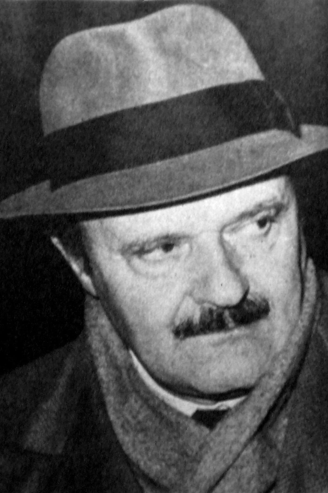

<dl>
<dt>Full Name</dt><dd>Calvi (born Roberto Calvi)</dd>
<dt>Clan</dt><dd>Lasombra</dd>
<dt>Generation</dt><dd>11th</dd>
<dt>Sire</dt><dd>Dinaro (10th gen Lasombra, nomadic)</dd>
<dt>Haven</dt><dd>Underground City, southern tunnels (converted maintenance bay beneath Place Bonaventure)</dd>
<dt>Nature / Demeanor</dt><dd>Architect / Director</dd>
<dt>Role</dt><dd>Ductus, Les Fossoyeurs</dd>
</dl>

## Who Is He

Calvi is the quietest person in every room he enters. Born Roberto Calvi in 1954 in the Quartieri Spagnoli of Naples, he ran financial operations for a Camorra caporegime before he was twenty-five. He understood debt the way a surgeon understands anatomy: as a system of leverage points, each one capable of immobilizing the whole body. He was twenty-eight when a Zurich hotel room became an operating theater and the debt economy he had mastered revealed itself as a shadow of something far older.

He is the ductus of Les Fossoyeurs. He does not give orders. He describes problems.

---

## Before

The Quartieri Spagnoli had been a garrison since the sixteenth century. Roberto grew up inside its economy of obligation. By fourteen he was reorganizing a usurer's ledger system. By twenty he managed the financial operations for an entire Camorra territory: loan books, protection payments, real estate laundered through a construction company that occasionally built things. He married a pharmacist's daughter. They had a son. The marriage was functional. Roberto loved systems more than people.

When his patron was killed in 1981, the territory fragmented and Roberto's meticulous books became a prize that multiple factions wanted to possess and none wanted to leave in his hands. He fled to Zurich with memorized account numbers and a forged passport.

---

## The Embrace

Dinaro found him on the fourteenth night. A thin man in a dark suit that fit too well, sitting across from him at a cafe on the Limmatquai, speaking Neapolitan dialect. The men from Naples had found his hotel. They would arrive tomorrow. There was an alternative.

The Embrace happened that night. No ritual. No burial. Dinaro did not believe in theater. He believed in results. Roberto woke with a hunger that tasted like copper and an understanding that the debt economy he had mastered was a shadow of something far more absolute. Dinaro gave him a new name -- Calvi, after the Corsican city where the Foreign Legion trained -- and brought him across the Atlantic.

---

## The Mission

Vykos assigned the mandate through intermediary: build a forward intelligence cell in Montreal. Staff it. Make it self-sustaining. Report through Dinaro. Calvi spent two years identifying candidates before assembling the pack. He found Constanzo through Ezekiel's network. He recruited Puente from The Rose's orbit.

The founding Vaulderie was conducted in October 1991 in a basement beneath a dim sum restaurant on de la Gauchetiere Street. Three Kindred drank from a nganga filled with graveyard earth. Les Fossoyeurs existed.

---

## What He Wants

**To build something that maintains itself.** Not a throne. Not a title. A system of obligations so well-structured that it runs whether he is present or not. The Inner Voice tells him that power exercised visibly is power already half-spent.

## What He Fears

**Dinaro.** The sire who chose him in that Zurich hotel room. The Long Road demands the childe eventually surpass the sire. Calvi has not yet been tested against the man who made him. He does not know what he would choose if Dinaro's interests and the pack's diverged.

**Being a component again.** He spent his mortal life as a function inside someone else's machine. The Fossoyeurs are his machine. If Vykos's mandate reduces the pack to disposable assets, the architecture he has built means nothing.

---

## Voice

> "The situation has three outcomes. Two of them require us to move tonight. The third requires us to have moved last week."

> "I don't give orders. I describe the problem. If you need the solution explained, you're in the wrong pack."

> "Il debito non muore." (*The debt does not die.*)
