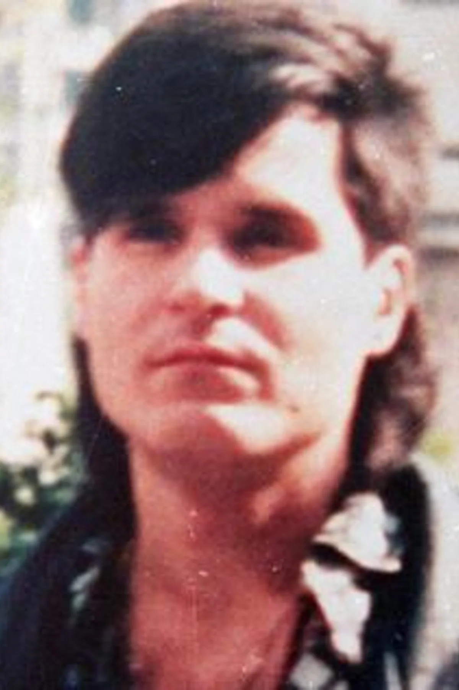

<dl>
<dt>Full Name</dt><dd>Constanzo (born Yelena Constanzo)</dd>
<dt>Clan</dt><dd>Serpent of the Light</dd>
<dt>Generation</dt><dd>10th</dd>
<dt>Sire</dt><dd>Ezekiel (10th gen at Embrace, now 8th via diablerie)</dd>
<dt>Haven</dt><dd>Underground City, southern tunnels (ritual space marked with vitae patterns) / rotating surface apartments under alias</dd>
<dt>Nature / Demeanor</dt><dd>Visionary / Bon Vivant</dd>
<dt>Role</dt><dd>Pack Priest / social operative, Les Fossoyeurs</dd>
</dl>

## Who Is She

Born in Matamoros. Catholic school, honor roll, volleyball scholarship to a Texas border college. The kind of girl admissions offices photograph for brochures. She learned Palo Mayombe the way she learned everything else -- with the focused discipline of someone who has never failed a test in her life. Her nganga sits in a room behind a room behind a room, and the saints on the shelf in the front room are real to her too. That is the thing people misunderstand. The syncretic practice is not a contradiction. The Catholic guilt and the Afro-Caribbean spirits and the Sabbat's liturgy of Caine all run on the same current: something larger than you demands sacrifice, and you deliver it beautifully, and you are rewarded with authority over those who cannot.

She is beautiful the way a woman in a Sears portrait studio is beautiful -- composed, symmetrical, appropriate. Not Toreador beauty, which announces itself. Hers is the beauty of someone who has learned exactly which version of herself each room requires. The spirits she channels are older than the Sword of Caine and will outlast it, and she knows this, and the Sabbat is wise enough not to ask what that knowledge costs her loyalty. There is a moral vacancy behind the competence that surfaces only in unguarded moments -- a blankness when the ritual is over and the spirits have receded and she is, briefly, no one's priestess and no one's madrina and no one's mirror. In those moments she looks like what she is: a void that learned to pray because prayer gave the void a shape.

---

## Before

Yelena Constanzo was born in 1964 in Matamoros, Tamaulipas, on the Texas border. Her mother cleaned houses in Brownsville. Her father was a tata nganga -- a priest of Palo Mayombe who served the Enkisi from a room behind the family's cinder-block house while running a legitimate botanica on the street side. Mornings were Catholic: mass at Nuestra Senora del Refugio, the nuns' catechism, the Stations of the Cross memorized before she was ten. Evenings were her father's. The nganga sat in its room -- a cast-iron cauldron filled with sacred earth, human bones, iron railroad spikes. It was not a decoration. It was a telephone. The Enkisi answered when you dialed correctly.

Yelena was bright enough to leave. Volleyball scholarship to Texas Southmost College in Brownsville -- physical education, dean's list, the kind of student who organized study groups and remembered everyone's birthday. She crossed the bridge to Matamoros on weekends to tend the nganga after her father's health failed. Her classmates knew her as a friendly girl who went home a lot. They did not know what home contained.

Her father died in 1988. She sat in front of the nganga and waited. The nganga answered. The spirits had been waiting for her father to die. Not cruelty. Protocol. She was initiated as a yaya that night, alone in the room, with the candles guttering and the bones rearranging themselves inside the cauldron. She was twenty-four and she understood that the border she had been crossing her whole life -- Brownsville to Matamoros, English to Spanish, Catholic to Palo, bright student to palera -- was not a division. It was a hinge. She was the door.

---

## The Embrace

Ezekiel came to the border in 1989 looking for a palera -- a mortal practitioner whose Palo knowledge predated the Embrace and could survive the transition intact. The Serpent of the Light needed practitioners, not converts. He observed Yelena for three months. He watched her call Zarabanda into the nganga while wearing a Texas Southmost College t-shirt, her hair still damp from volleyball practice. The cauldron's contents shifted. Bones realigned. Iron spikes stood upright as if magnetized. She did not flinch. She asked the spirit a question in a dialect Ezekiel did not recognize.

He Embraced her the following week. The Embrace was violent -- Yelena fought, and Ezekiel was not gentle. Her first coherent thought was that the nganga was unattended and the spirits would be angry. They were not angry. They had been waiting for this, too.

---

## The Unlife

She chose the name Constanzo after the Palo tradition's emphasis on the constancy of the dead. She learned Wanga from the Serpent elders in Montreal but filled the system with Palo content -- her Flow of Ashe preparations used herbs her father had taught her, her rituals invoked the Enkisi by name, her nganga traveled with her.

The beauty was always there, but in Montreal she learned to use it. Not the way a Toreador does -- not as supernatural compulsion, but as interface. She is the pack's second face, the one who walks into a room full of mortals and becomes whatever the room needs: the concerned social worker, the flirtatious graduate student, the quiet woman at the bar who remembers your name. She performs warmth with the precision of a method actress. Inside the pack, the mask comes off: cold, observant, cataloguing weaknesses. The other Fossoyeurs are not fooled by the performance. They rely on it.

She retains Humanity rather than adopting a Path. This is not idealism. It is camouflage. A Sabbat vampire on Humanity 5 can pass among mortals without the behavioral tells that Paths produce. The cost is restraining what stirs beneath the composure -- the moments when the ritual ecstasy and the void behind it and the beauty of someone else's suffering all converge, and the world becomes high-definition, and she has to close her eyes to keep the performance intact.

She reports to Ezekiel selectively -- enough intelligence to maintain his trust, nothing that would compromise the pack's autonomy. The gap between what he asks and what she knows grows wider every month.

---

## What She Wants

**The Enkisi's attention.** Not power for its own sake. The sustained presence of spirits that existed before Caine, before Christ, before the Kongo kingdoms that first named them. Every ritual is a transaction. She intends to keep the line open.

**To be seen without being known.** The performance of warmth is the closest she comes to connection. If someone sees through it -- truly sees the blankness underneath -- the calculations stop working.

## What She Fears

**A cold nganga.** If the Enkisi withdraw -- if the terms of the transaction become unacceptable -- the cauldron goes silent. She would be a wangateur without spiritual connections. A thaumaturge without a grimoire.

**Ezekiel's patience running out.** He considers her an asset, not a daughter. The blood does not forget who made it.

**That the warmth will stop being a performance.** Needing people is the closest she comes to loving them. If it becomes real, the void has nothing left to hide behind.

---

## Voice

> "The dead do not respond to volume."

> "You look like you've had a night. Buy you a drink? I'm a good listener -- ask anyone."

> "Ezekiel asks. I answer what is worth answering. The nganga tells me what is worth telling. These are not the same list."

> "You do not touch the nganga. This is not a request."
