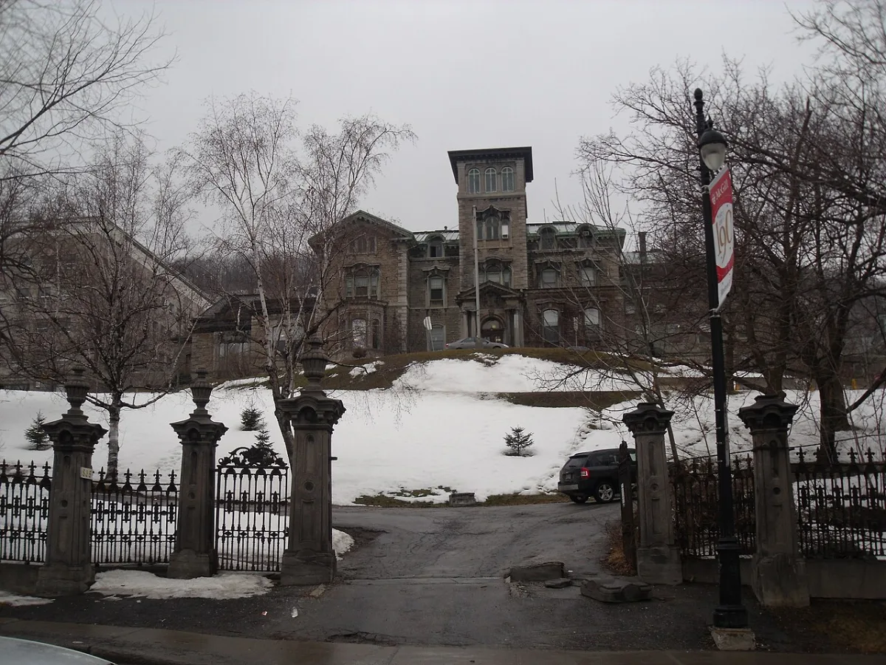

<dl>
<dt>District</dt><dd>Golden Square Mile</dd>
<dt>Type</dt><dd>Pack headquarters and war council</dd>
<dt>Claimed By</dt><dd>Pack 25:17</dd>
<dt>City</dt><dd>Montreal</dd>
</dl>

## Physical Read

- A 19th-century mansion on Pine Avenue, set back behind a stone wall and old trees. The former ballroom serves as the main dance floor for the nightclub — gray linoleum tiles stained from years of psychiatric use. The first and second floors contain old patient rooms and examination rooms still furnished with medical equipment. The atmosphere is institutional horror repurposed as entertainment. Mortals and Kindred both attend. Most humans don't survive the night.
- The basement contains intricate corridors and cells illuminated by black lights and candles, plus human remains. Each Pack 25:17 member has a personal haven in secret passages. Tunnels lead to a ruined chapel that serves as the communal lair.
- The Vaulderie chalice sits on a shelf in the main meeting room, cleaned and waiting.

## Function in Play

- Pack 25:17's headquarters. Where assignments are received, disputes are settled, and the Vaulderie is performed.
- The location where the coterie faces the most direct pressure to participate in Sabbat rituals. Refusing here has consequences.
- War council site as the Quebec siege approaches. The planning happens in this room.

## Who Controls It

- Pack 25:17 collectively, but the pack leader's authority determines what happens inside.
- The warehouse is claimed territory — approaching without pack affiliation is hostile until proven otherwise.
- During war councils, visiting pack leaders and their seconds are admitted. The security perimeter expands to cover the surrounding block.
