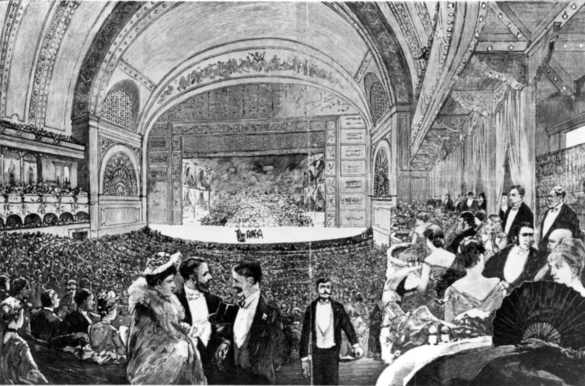

<dl>
<dt>District</dt><dd>Loop / South Michigan Avenue</dd>
<dt>Type</dt><dd>Elysium site and event venue</dd>
<dt>Claimed By</dt><dd>Camarilla (Elysium)</dd>
<dt>City</dt><dd>Chicago</dd>
</dl>

## Physical Read

- Adler and [Sullivan](/npcs/sullivan-dane/) designed it in 1889. Golden arches, frescoed ceiling, acoustic engineering that carries a whisper from the stage to the back row. The beauty is real. The Kindred use it as set dressing.
- Backstage is cramped hallways, prop storage, costume racks, and loading access from the alley. During Sabbat incursions, these corridors become kill zones.
- Below the main hall, the foundations are old Chicago limestone and poured concrete. Somewhere in the substructure, sealed behind a slab, [Jefferson](/npcs/jefferson-foster/) waits.

## Function in Play

- Elysium during formal events. Sullivan's golden arches and four thousand seats make it the grandest stage Chicago's Kindred use, and the most exposed.
- The Blood Bond opera scene. A performance weaponized. When Bond rituals get dressed in evening wear and forced on an audience that cannot refuse without admitting what they are.
- [Bach](/npcs/bach/)'s Sabbat bikers crash this venue. The concrete slab hiding Jefferson is somewhere in this building's foundations. Elysium shatters when the Sabbat come through the doors.

## Geographic Placement

- **Address:** 50 East Congress Parkway (formerly East Congress Parkway, later renamed East Ida B. Wells Drive). Part of the Auditorium Building, designed by Adler & Sullivan, opened 1889. The building underwent considerable renovation but retains its original bones.
- **Neighborhood:** Loop / South Michigan Avenue, at the southern edge of the Loop commercial district. The building faces Congress Parkway and Michigan Avenue.
- **Proximity:** Three blocks south of [the Art Institute](/locations/art-institute/) (111 S Michigan) along Michigan Avenue. Six blocks south of [Lodin](/npcs/lodin/)'s Prudential Building. Grant Park and the lakefront are one block east. The [Sears Tower](/locations/sears-tower/) is roughly half a mile west on Congress to Wacker.
- **Transit:** CTA Red/Blue Line to Harrison or [Jackson](/npcs/kevin-jackson/). The Loop elevated tracks are two blocks north. Congress Parkway provides direct east-west vehicle access. The alley behind the building serves as loading dock and discreet Kindred entrance.

## Who Controls It

- Elysium by Prince's declaration. The Toreador claim cultural stewardship. The building's mortal management runs the calendar.
- During events, Camarilla security is present but focused on decorum, not combat. The assumption is that Elysium holds because everyone agrees it should.
- That assumption breaks when Bach's Sabbat riders arrive. The Theatre is not designed to withstand a firefight.
