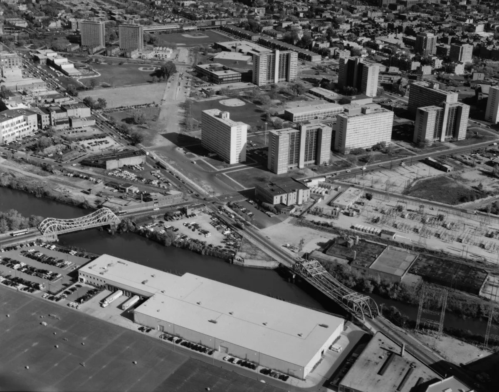

<dl>
<dt>District</dt><dd>Near North Side</dd>
<dt>Type</dt><dd>Gang territory and feeding ground</dd>
<dt>Claimed By</dt><dd>[Kevin Jackson](/npcs/kevin-jackson/)</dd>
<dt>City</dt><dd>Chicago</dd>
</dl>

## Physical Read

Three phases of construction, three textures of institutional failure:

- **The Rowhouses** (1942, Phase I): 54 two-story brick buildings, 586 units. Named for Saint Frances Xavier Cabrini. Built under the Housing Act of 1937 to house wartime industrial workers, replacing the Sicilian immigrant slum called "Little Hell." In 1942 these were decent housing. By 1990 the rowhouses are the least-damaged structures in the complex — low-density, human-scale, still inhabited.
- **The Reds** (1957-58, Phase II): 15 mid-and-high-rise buildings, 7 to 19 stories, 1,925 units. Red brick. Cabrini Extension North and South. South of Division, bordered by Larrabee (west), Orleans (east), Chicago Avenue (south). Built under the Housing Act of 1949. This is where the vertical concentration began.
- **The Whites** (1962, Phase III): 8 towers, 15-16 stories, 1,096 units. White reinforced concrete slabs. [William](/npcs/william-shepard/) Green Homes. North of Division. Designed by Pace Associates in Mies van der Rohe's tower-in-a-park idiom — tall rectangular slabs raised on columns, set far apart in open space with streets closed to create superblocks. Le Corbusier's vision built with public housing budgets. The "green space" between towers was paved over to save on maintenance costs and never restored.

**Total complex: ~3,607 units across 70 acres. 23 high-rise/mid-rise buildings plus the 54 rowhouses.**

What you see at street level in 1991: concrete and brick gone gray-brown with exhaust and neglect. Broken windows patched with cardboard and plastic sheeting. The open-air gallery corridors on the Whites — originally marketed as "sidewalks in the air" — enclosed with chain-link fencing after residents and objects were thrown from upper floors. The fencing gives the buildings the silhouette of prison tiers. Fire-damaged units boarded up but never repaired, locks broken, squatters inside. The courtyard hardscapes between towers are wasteland — paved earth, broken glass, the rusted stumps of playground equipment removed years ago. Streetlights shot out and never replaced.

From the 16th floor of a White tower you can see Lake Michigan, Lincoln Park, the [Gold Coast](/locations/gold-coast/) high-rises, the Magnificent Mile. Ten minutes' walk east and you're in a different country. The wealth of Chicago sits half a mile from this and turns its back.

**The stairwells.** Every lightbulb smashed or never replaced. Complete darkness from the 6th floor up. People sitting on the landings in the dark, watching you climb. Gang members controlling vertical movement — the wrong floor belongs to the wrong faction and the penalty for trespassing is not a conversation. Police reportedly said "the law stops at the sixth floor." Residents — mothers with strollers, elderly on walkers — climb 15 flights in the dark because the elevators haven't worked in months and when they do work the gangs tax you to ride.

**The galleries and breezeways.** Chain-link-enclosed walkways running the length of each floor on the Whites, open to wind and weather. Designed to separate pedestrian from vehicle traffic. Instead: concealed corridors for undetected gang movement and territorial control. Panoramic views of the [Gold Coast](/locations/gold-coast/) through cage wire.

**The walls.** Construction was cheap. Bathroom vanities back-to-back between adjacent units with nothing but drywall between them. Criminals and gang members breach apartments through the vanity wall — the scene in Candyman where the killer comes through the medicine cabinet mirror is not fiction. It's architecture.

## Function in Play

- [Kevin Jackson](/npcs/kevin-jackson/)'s territory. The projects. Bloods gang presence, poverty, and the kind of violence that doesn't make the news because it happens every night.
- Feeding ground where blood is abundant but every hunt carries risk. The residents are not passive. They watch. They remember.
- A mirror of [Darius](/darius-cole/)'s west-side Gary operation, scaled up and without the pretense of subtlety.

## Geographic Placement

- **Address:** Cabrini-Green Housing Project, centered at Sedgwick Street and Locust Street, Near North Side. Despite sitting in the geographic middle of the Rack, classified as [the Barrens](/locations/the-barrens/) by Chicago's Kindred.
- **Neighborhood:** Near North Side. Bordered roughly by Division Street (north), Halsted (west), Chicago Avenue (south), and the river. Old Town Triangle is further west.
- **Proximity:** Half a mile west of the [Gold Coast](/locations/gold-coast/) and North Michigan Avenue. The [Succubus Club](/locations/succubus-club/) and the Rack's nightlife are a short walk east on Division. [The Brewery](/locations/the-brewery/) and Daley's are nearby on Clark and State. Lincoln Park is north.
- **Transit:** CTA buses on Division, Larrabee, and Clybourn. CTA Red Line to Chicago/State is the nearest L stop, several blocks east. No convenient rail — the projects are designed to be close to everything and connected to nothing.

## Deep Background: Why This Place Exists

Cabrini-Green was not an accident. It was a policy.

The Chicago Housing Authority, under the direction of aldermen who had informal veto power over project placement, built every high-rise public housing project in already-Black neighborhoods. The 1969 Gautreaux v. CHA ruling confirmed that the CHA's site selection was racially discriminatory. 85% of Chicago was covered by racial covenants restricting sales to African Americans. The projects concentrated the poverty that white flight, deindustrialization, and redlining had already created.

The site itself — the Near North Side — was a slum before Cabrini-Green. The Sicilian immigrant neighborhood called "Little Hell" (before that, an Irish shantytown) occupied this ground from the 1850s. Harvey Warren Zorbaugh documented the [Gold Coast](/locations/gold-coast/)/slum divide here in 1929. The public housing replaced one kind of poverty with another, taller kind. The proximity to wealth is not ironic. It is architectural. The city put its poorest residents on its most valuable land and then spent fifty years trying to figure out how to get them off it.

By 1990, the answer is demolition. Speculators are buying land on every side of the complex. River North is booming. The Gold Coast presses from the east. [Richard](/npcs/richard-fulcher/) M. Daley, three years into his first term, is already calculating the math. The towers will come down. The question is when, and what happens to the 15,000 people inside.

In the World of Darkness, the question has a sharper edge. [Kevin Jackson](/npcs/kevin-jackson/) controls Cabrini-Green. If the towers come down, his domain — the most heavily fortified Kindred territory in Chicago — goes with them. In the V20-era Beckett's Jyhad Diary, [Jackson](/npcs/kevin-jackson/) has become Prince of Chicago and still operates from the last remaining Cabrini tower. He held the ground while the city demolished everything around him. A shadowy financial faction owns the property and charges him rent.
