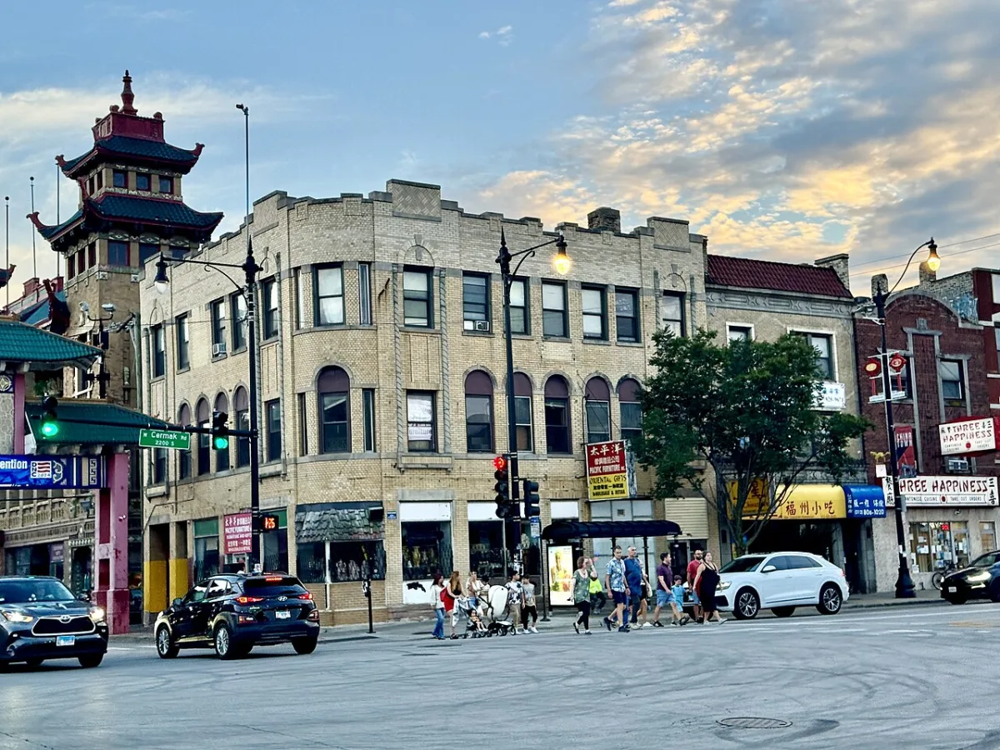

<dl>
<dt>District</dt><dd>Armour Square (Old Chinatown) / Uptown-Argyle (New Chinatown)</dd>
<dt>Type</dt><dd>Territory and haven</dd>
<dt>Claimed By</dt><dd>[Chuc Luc](/npcs/chuc-luc/)</dd>
<dt>City</dt><dd>Chicago</dd>
</dl>

## Physical Read

- Old Chinatown: the Cermak Road gate, red lanterns, pork buns and roast duck in steamed windows, tourist foot traffic that thins after midnight into delivery trucks and closed grates.
- New Chinatown on Argyle: narrower streets, Vietnamese signage, pho shops open late, the smell of star anise and fish sauce hanging in the cold air. Less foot traffic. More cameras in the storefronts.
- The cellar haven: concrete stairs behind a kitchen. Cold storage repurposed. No natural light, reinforced door, the smell of ginger and old blood. Functional. Ruthless. Like its occupant.

## Function in Play

- [Chuc Luc](/npcs/chuc-luc/)'s domain. Two territories, one mind. Old Chinatown is the public face, Wentworth Avenue and Cermak Road. New Chinatown is the pipeline hub, Argyle Street in Uptown, Vietnamese restaurants and import shops.
- [Darius](/darius-cole/)'s sire-childe bond with [Chuc Luc](/npcs/chuc-luc/) makes these streets simultaneously the safest and most dangerous ground in Chicago for him.
- The Vietnamese restaurant cellar on Argyle is [Chuc Luc](/npcs/chuc-luc/)'s haven. She kills intruders. No warnings, no exceptions, no bodies found.

## Geographic Placement

- **Old Chinatown:** Bordered by West Cermak Road, Wentworth Avenue, Archer Avenue, Canal Street, and 26th Street, in the Armour Square neighborhood. South Side, below the Loop. Tunnels beneath the streets where triads are rumored to meet.
- **New Chinatown:** Argyle Street in the Uptown neighborhood, North Side. Vietnamese community that migrated north from Old Chinatown's Lakeview overflow. Chuc Luc's haven sits in the cellar of a Vietnamese restaurant here.
- **Distance between territories:** Roughly seven miles, connected by the CTA Red Line. Old Chinatown: Red Line to Cermak-Chinatown stop. New Chinatown: Red Line to Argyle stop.
- **Proximity:** Old Chinatown borders Bridgeport (old Daley territory, Union Stockyard Gate at Exchange and Peoria) to the west and [Capone](/npcs/capone/)'s former South Side Italian territory. New Chinatown in Uptown sits near [Graceland Cemetery](/locations/graceland-cemetery/) ([Inyanga](/npcs/inyanga/)) and the Lakeview neighborhood.
- **Gary approach:** The Dan Ryan Expressway / I-94 from Gary passes through Old Chinatown's periphery. Every Kindred driving from Gary to the Loop passes Chuc Luc's southern domain.

## Who Controls It

- Chuc Luc. Completely. She has operated in this city longer than most Chicago Kindred realize, and the communities she feeds from protect her without knowing what she is.
- Mortal community leaders owe her favors through intermediaries. Gang activity in her territory is low because the last three people who tried to establish it disappeared.
- The proximity to [Capone](/npcs/capone/)'s old South Side territory creates friction. The Italian Kindred remember whose ground this used to be.
