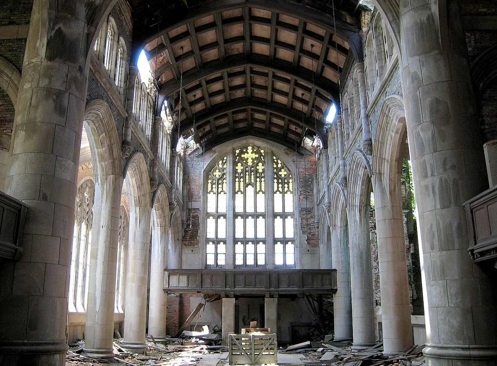

<dl>
<dt>District</dt><dd>Central Gary / Downtown West</dd>
<dt>Type</dt><dd>Ruin / atmospheric location</dd>
<dt>Claimed By</dt><dd>none</dd>
<dt>Theme</dt><dd>Institutional Rot</dd>
<dt>Mood</dt><dd>Roofless echo, weather indoors, and civic afterlife</dd>
<dt>City</dt><dd>Gary</dd>
</dl>

## Physical Read

- 577 Washington Street. Gothic revival architecture. Stone walls still standing, three stories of them, buttressed and arched. The roof is gone. Open sky where the ceiling was. Vegetation grows through the floor -- trees pushing up through cracked tile, vines crawling the interior walls.
- Stained glass mostly shattered. A few panels remain in the upper transept, catching streetlight at angles that make the interior glow amber and red.
- The nave is an open canyon. Pews long since scavenged. The altar platform remains, elevated, commanding the space. Standing there feels like addressing a congregation of ghosts.
- At night, the roofless interior fills with weather. Rain falls on the altar. Snow covers the floor in winter. The building is a church-shaped hole in the city, open to whatever wants in.

## Function in Play

- An iconic landmark of Gary's collapse. The largest Methodist church in the Midwest, built in 1925, closed in 1975, and left to rot. A symbol of everything the city lost.
- Atmospheric set piece for scenes that need the weight of institutional death. Negotiations, confrontations, or solitary moments where the ruins say more than dialogue.
- Potential haven site, ritual location, or ambush ground. The structure is massive and open, with sight lines that favor whoever arrives first.

## Who Controls It

- No one. The city owns the property and does nothing with it. No Kindred has claimed it. No mortal organization maintains it.
- Vagrants use it intermittently. They do not stay long. The building has a quality that discourages lingering -- not supernatural, just the deep unease of standing inside something that was supposed to last forever and didn't.
