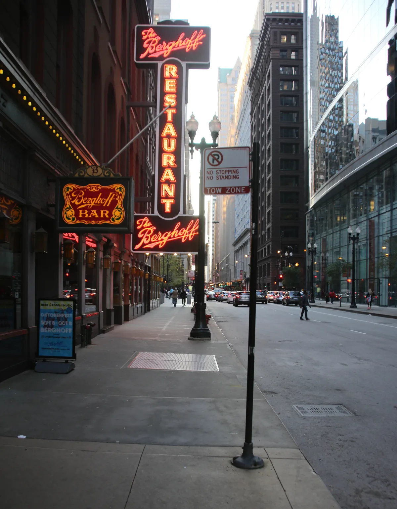

<dl>
<dt>District</dt><dd>Near North / River North</dd>
<dt>Type</dt><dd>Ventrue power dining and political venue</dd>
<dt>Claimed By</dt><dd>[Ballard](/npcs/ballard/)</dd>
<dt>City</dt><dd>Chicago</dd>
</dl>

## Physical Read

- Old-money steakhouse. Dark wood paneling, white tablecloths, brass fixtures gone green at the edges. The booths are high-backed leather that blocks sightlines from the dining room.
- Ballard's booth is in the back corner, facing the entrance. He can see everyone who walks in. Nobody at the bar can see him.
- The kitchen sends out courses whether anyone ordered them or not. Porterhouse, creamed spinach, baked potato, Scotch. The staff knows not to clear a plate until Ballard nods. The food gets cold. Ballard does not care. He ate three centuries ago.

## Function in Play

- Where Ballard holds court. The table is always reserved. The food is always ordered. The guest is always expected to eat while Ballard watches, and the watching is the point.
- Political intimidation dressed as hospitality. Ballard forces food on his guests because it reminds them they have bodies, and bodies are vulnerable.
- The place where [Darius](/darius-cole/) receives his Chicago assignments and learns what Ballard's patience looks like when it starts to thin.

## Geographic Placement

- **Address:** West side of the 1000 block of North State Street, Near North Side. Fictional restaurant placed in the CbN setting. American/International cuisine, high prices, exclusive clientele.
- **Neighborhood:** Near North / River North, in the transition zone between the Rack's nightlife and the residential North Side. Adjacent to [the Brewery](/locations/the-brewery/).
- **Proximity:** Physically backs onto the Brewery (N Clark facing Dearborn) — Ashes to Ashes establishes you can jump from Daley's roof to the Brewery's roof. The [Succubus Club](/locations/succubus-club/) and [the Cave](/locations/the-cave/) are a few blocks south on State Street. Eight blocks from Ballard's undisclosed primary residence. The Loop is south across the river.
- **Transit:** CTA Red Line to Clark/Division. Cab access from State Street. The restaurant's street presence looks like any other high-end Near North steakhouse — the Kindred significance is invisible from the sidewalk.

## Who Controls It

- Ballard owns the building through a holding company. The restaurant manager is a ghoul who has run the front of house for twenty years and will run it for twenty more.
- The mortal staff are professionals. They notice nothing because they are paid to notice nothing, and they are very good at their jobs.
- Other Ventrue use the restaurant by invitation. The reservation book is a political document.
