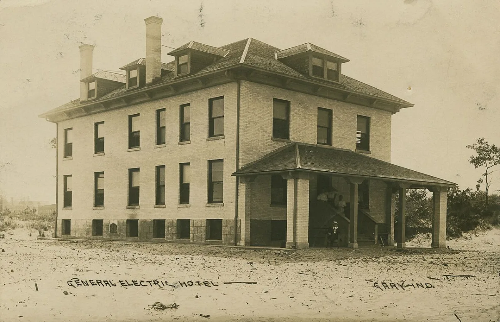

<dl>
<dt>District</dt><dd>Westside / Tolleston seam</dd>
<dt>Type</dt><dd>Haven and check-cashing front</dd>
<dt>Claimed By</dt><dd>[Darius](/darius-cole/)</dd>
<dt>Theme</dt><dd>Debt as Shelter</dd>
<dt>Mood</dt><dd>Tight, provisional, and watched from the block</dd>
<dt>City</dt><dd>Gary</dd>
</dl>

## Physical Read

- Ground-floor apartment, used car, cash business, tired storefront logic, and a neighborhood that notices patterns even when it minds its own business.

## Function in Play

- [Darius](/darius-cole/)'s operational base.
- Where debt, hunger, laundering, and cover-story maintenance all meet.

## Who Controls It

- Darius for now.
- Mortals like [Marlene](/npcs/marlene-voss/) and local debtors define whether it feels invisible or talked about.
