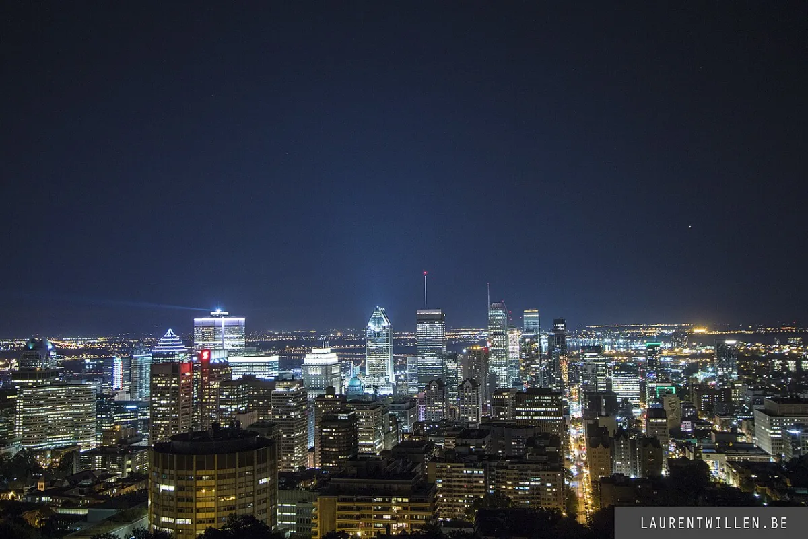

<dl>
<dt>District</dt><dd>Downtown</dd>
<dt>Type</dt><dd>Communal haven and coterie starting base</dd>
<dt>Claimed By</dt><dd>Pack system (communal)</dd>
<dt>City</dt><dd>Montreal</dd>
</dl>

## Physical Read

- A public park surrounded by hotels, office towers, and the Sun Life Building's limestone bulk. At night the benches empty out and the square belongs to the homeless, the sleepless, and the dead.
- Underground access through a maintenance grate behind the Dominion Square Building. The lock has been broken for years. Nobody fixed it because nobody who matters goes down there.
- The haven itself is not a maintenance room. Beneath the park, the original cholera-era mausoleum opens into a vaulted central chamber with a thirty-foot ceiling. Marble statues of angels and devils line the walls. Two levels of crypts form balconies accessed by spiraling staircases. A continuous frieze depicts Book of Nod scenes and Sabbat history. The Archbishop's throne is made of human bone. Candles and recently added electric lights illuminate a space that accommodates five hundred vampires. The Alexandrium Library adjoins the main chamber through the Gates of Eternity — elaborate bronze doors guarded by the Librarians. The Lost Angels' lair opens from the rear of the mausoleum, decorated like an eighteenth-century home with indoor black-rose gardens.
- At the surface, it remains what it appears: a park with trees, benches, and poor lighting. The distance between what the city sees and what exists beneath it is the Sabbat's entire operating principle.

## Function in Play

- The coterie's temporary base of operations in Montreal. Starting point for every night's movement.
- Where pack assignments arrive. Where the coterie regroups when things go wrong.
- Access point to the tunnel network below, linking the square to the Underground City and multiple escape routes.

## Who Controls It

- No single Kindred claims Dorchester Square. It belongs to the pack rotation — a communal resource allocated by whoever holds authority that week.
- Valez's people know it exists. They tolerate it because communal havens keep neonates visible and controllable.
- The real control is architectural. Anyone who knows the tunnel access points can enter or leave without using the street.
