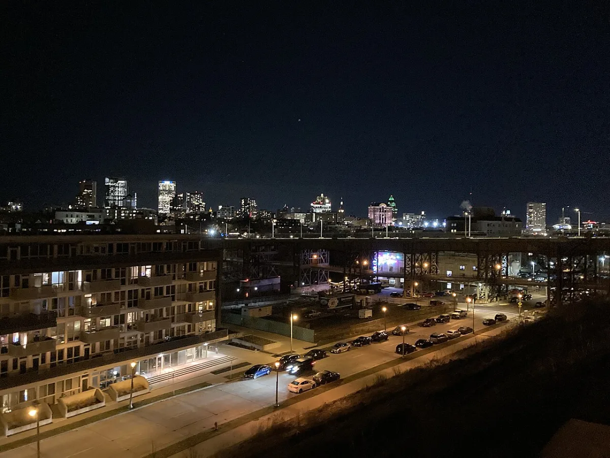

<dl>
<dt>District</dt><dd>East Downtown</dd>
<dt>Type</dt><dd>Anarch territory, nightlife strip</dd>
<dt>Claimed By</dt><dd>Contested (Blood Brothers vs Union)</dd>
<dt>City</dt><dd>Milwaukee</dd>
</dl>

## Physical Read

- Dive bars with neon along E Brady St and E North Ave. Clubs with no dress code. Alleys with bad lighting and worse acoustics.
- The nightlife draws feeding stock and witnesses in equal measure.
- Graffiti marks territory. Blood Brothers tags on the east side, Union marks near the marina. The mortals who live here know which blocks belong to which crew even if they do not know why.
- Broken glass on the sidewalk most mornings. The city cleans it up. It returns.
- N Lincoln Memorial Dr runs the length of the lakefront — a single arterial connecting [Turk](/npcs/turk/)'s marina to [Scott](/npcs/sir-edward-scott/)'s neighborhood to Badr's UWM-adjacent condo.

## Function in Play

Where the gang war happens. East Downtown is the feeding ground, the combat zone, and the place the Primogen Council pretends does not exist. Bars, clubs, live venues, and the violence that follows them. [Akawa](/npcs/akawa/)'s Blood Brothers hold the east blocks, [Turk](/npcs/turk/)'s Union holds the area around the marina. The border between them shifts nightly.

## Who Controls It

- Nobody. [Akawa](/npcs/akawa/) and Turk each claim sections, but the border is contested.
- The Primogen Council has no official presence. Elder Kindred do not visit.
- Mortal gang structures overlap with Kindred territory. The violence is layered.
- [Scott](/npcs/sir-edward-scott/) and Badr maintain havens on the east side but do not involve themselves in the gang war.
