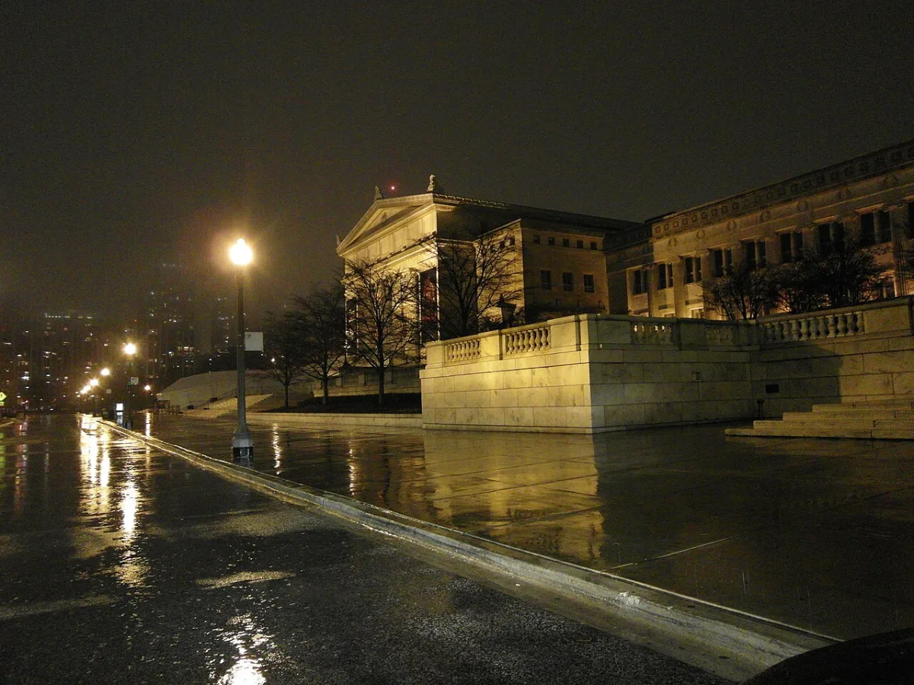

<dl>
<dt>District</dt><dd>Museum Campus / South Loop</dd>
<dt>Type</dt><dd>Elysium site</dd>
<dt>Claimed By</dt><dd>Camarilla (Elysium)</dd>
<dt>City</dt><dd>Chicago</dd>
</dl>

## Physical Read

- Marble halls built to make you feel small. The mastodon skeletons in Stanley Field Hall stand with their tusks aimed at the entrance like sentries who died at their posts.
- At 3 AM the galleries are lit by emergency lighting and whatever the Kindred bring. Long shadows from taxidermied predators. Glass cases reflecting faces that shouldn't be there.
- The air is climate-controlled, dry, and carries the faint chemical smell of preservation. Everything in this building is dead and maintained to look alive. The irony is not lost on the Kindred.

## Function in Play

- Elysium where the False Prince holds court. After [Lodin](/npcs/lodin/)'s disappearance, [Neally](/npcs/neally-edwards/) takes the stage here, impersonating the Prince at 3 AM among the mastodons.
- A place where [Darius](/darius-cole/) must perform deference to authority he suspects is counterfeit.
- The museum's collection provides cover for meetings that would look strange anywhere else.

## Geographic Placement

- **Address:** 1400 South Lake Shore Drive, on the Museum Campus at the south end of Grant Park. Huge stone building on the lake shore.
- **Neighborhood:** Museum Campus / South Loop. Part of the lakefront Elysium corridor with the Shedd Aquarium to the east and the Adler Planetarium further out on the abutment.
- **Proximity:** Soldier Field is directly south, between McFetridge Drive and Waldron Drive. The [Art Institute](/locations/art-institute/) is roughly a mile north on Michigan Avenue. McCormick Place is further south on Lake Shore Drive. Grant Park and Buckingham Fountain to the north.
- **Transit:** Lake Shore Drive provides direct access from both directions. CTA buses along Roosevelt Road. Meigs Field (still operational in 1992) is on the lakefront at 15th Street, a short distance south. No nearby L stop — arrival by car or cab is standard for after-hours visitors.

## Who Controls It

- The Prince declares Elysium. In practice, the Primogen enforce it through mutual self-interest.
- Museum security is mortal and unaware. After hours access is arranged through a ghoul on the board of trustees.
- During the crisis, [Neally](/npcs/neally-edwards/) uses this space to project legitimacy. His control is as hollow as the dioramas.
