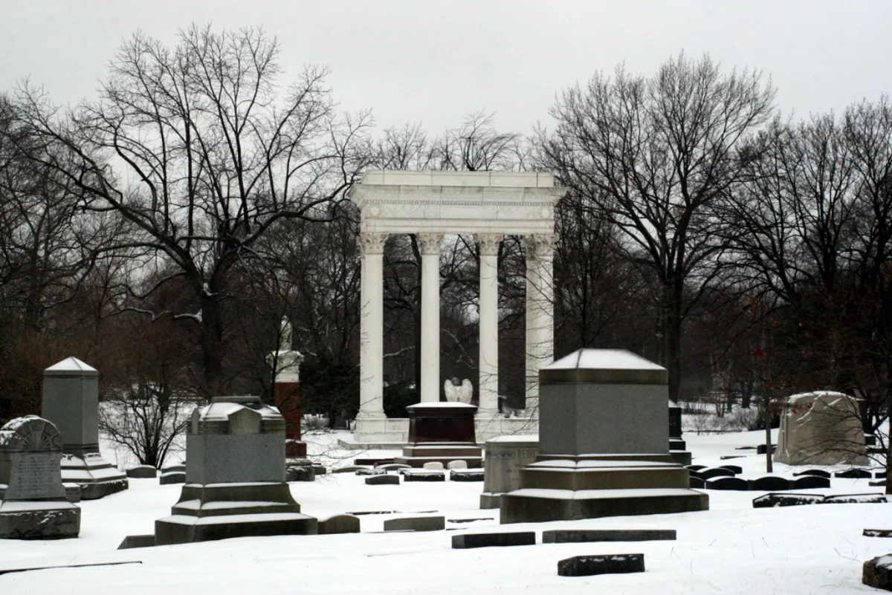

<dl>
<dt>District</dt><dd>North Side / Wrigleyville</dd>
<dt>Type</dt><dd>Cemetery / supernatural meeting point</dd>
<dt>Claimed By</dt><dd>none (Elysium-adjacent)</dd>
<dt>City</dt><dd>Chicago</dd>
</dl>

## Physical Read

- 119 acres of Victorian-era funerary architecture. Obelisks, mausoleums, weeping angels, and family plots behind wrought-iron fences.
- Old-growth trees canopy the paths. At night the cemetery is darker than the surrounding streets -- the tree cover blocks ambient city light.
- Quiet in a way that feels intentional. Traffic noise from Clark Street drops off within twenty yards of the gates. The dead keep their silence and enforce it on visitors.

## Function in Play

- A quiet node in Chicago's supernatural geography. Historic cemetery, final resting place of Allan Pinkerton, and the kind of place where the Shroud between the living and the dead wears thin.
- Beckett used it as a haven, sleeping in grave soil near the plot of Kate Warne -- Pinkerton's first female detective. The grave dirt of a woman who spent her life uncovering secrets, chosen by a Kindred who does the same.
- [Ublo-Satha](/npcs/ublo-satha/) left a protective scarab amulet here for Beckett. That amulet is a thread connecting the Tremere, [Menele](/npcs/menele/)'s sleeper agent, and whatever Beckett knows about the Methuselah conflict.

## Who Controls It

- The cemetery is a Chicago landmark. Mortal staff maintain it during daytime hours.
- No Kindred formally claims it. Its proximity to Elysium norms -- neutral ground, no violence -- is understood rather than declared.
- Beckett's presence was tolerated because Beckett is tolerated everywhere. Whether his departure left the site unclaimed or simply unwatched is an open question.
