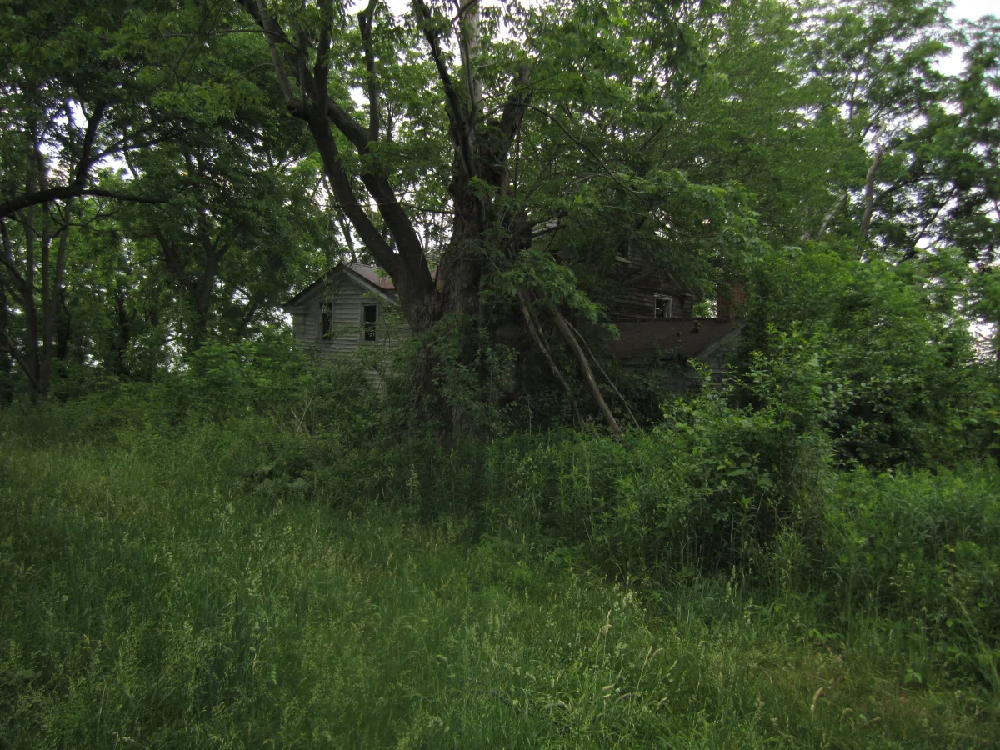

<dl>
<dt>District</dt><dd>Rural / one hour northwest of Chicago</dd>
<dt>Type</dt><dd>Cult compound</dd>
<dt>Claimed By</dt><dd>[Roarke](/npcs/roarke/)</dd>
<dt>City</dt><dd>Chicago</dd>
</dl>

## Physical Read

- Dense hardwood forest, no maintained road past the first quarter mile. The gravel track narrows to mud ruts and then to footpath. In fall, the leaf cover is thick enough to lose the sky.
- The earthen amphitheater is a natural bowl in the terrain, expanded by hand, terraced with fieldstone. Firepit in the center. Soot marks on the stones. The ground is stained dark in patterns that are not natural erosion.
- Underground tunnels radiate from the amphitheater. Rat tunnels. Packed earth, low ceilings, the smell of loam and animal musk. Somewhere in the network, a ram ghoul fed on Kindred blood patrols with the patience of something that does not sleep.

## Function in Play

- [Roarke](/npcs/roarke/)'s cult compound. Fifty wooded acres with an earthen amphitheater, underground tunnels, and enough isolation to muffle anything that happens here.
- The Ashes to Ashes climax location. The investigation trail may end in this pasture, where the answers are worse than the questions.
- Remote enough that rescue is not coming. Whatever [Darius](/darius-cole/) brings with him is all he has.

## Geographic Placement

- **Location:** A small copse of woods approximately 50 miles (one hour's drive) northwest of Chicago. 50 acres, mostly flat wooded terrain with rocky regions near the center. Private land, exclusively used for [Roarke](/npcs/roarke/)'s ceremonies.
- **Terrain:** Natural earthen amphitheater at center, accessed via a gully through rocks. Tunnel network radiates from the amphitheater to unmarked exit points in the surrounding forest.
- **Access:** Single gravel road from the nearest county highway. 15-minute walk from the road to the compound through unlit woods. Accessible by 4WD vehicles for part of the distance. No cell signal. No neighbors for miles.
- **Proximity:** Roughly in the direction of McHenry County or DeKalb County, northwest Illinois farmland. Far from any suburb with Kindred presence. O'Hare Airport ([Tyler](/npcs/tyler/)'s haven) would be the nearest Kindred-relevant landmark, roughly 30 miles southeast.

## Who Controls It

- [Roarke](/npcs/roarke/). The compound is his church, his fortress, and his feeding ground. His cult provides willing blood and manual labor.
- The cultists are mortal and genuinely believe. Their devotion is not Dominated into them, which makes it harder to break and more dangerous to underestimate.
- The blood-fed ram ghoul is an abomination that should not exist and does not care about that assessment. It guards the tunnels with animal cunning amplified by vitae.
