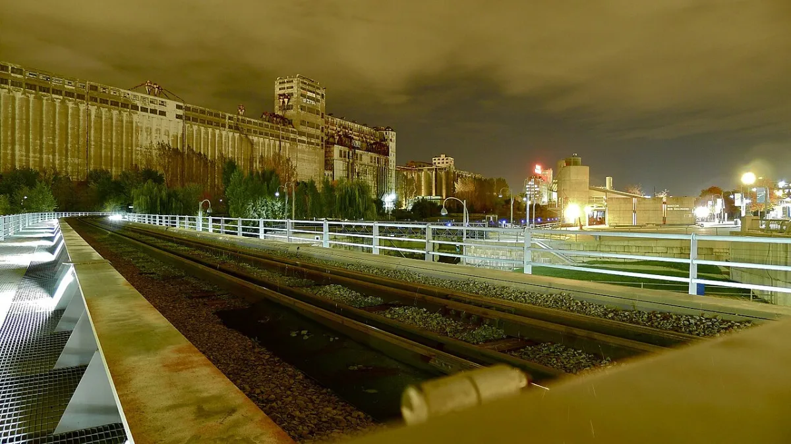

<dl>
<dt>District</dt><dd>Industrial east end</dd>
<dt>Type</dt><dd>Industrial corridor and feeding grounds</dd>
<dt>Claimed By</dt><dd>Contested (pack hunting grounds)</dd>
<dt>City</dt><dd>Montreal</dd>
</dl>

## Physical Read

- A fourteen-kilometer industrial canal running from the Old Port southwest to Lac Saint-Louis. The locks have been closed for decades. The water turns black and still.
- The banks are lined with abandoned factories, shuttered rail yards, and the remnants of Montreal's industrial spine. Brick buildings with broken windows. Loading docks that face the water. Chain-link fences with holes cut by people who needed to get through and didn't have keys. Little Burgundy's housing projects press against the canal's north bank near Atwater — the Sabbat Embrace dying children from these alleyways and let the frenzied beasts feast on their families.
- Homeless camps under the overpasses and in the derelict factory shells. Small fires in oil drums. The smell of kerosene and wet wool. These are the feeding grounds — people who won't be missed, who won't report, who have learned not to scream at things that happen after dark.

## Function in Play

- Primary feeding grounds for the coterie and multiple Sabbat packs. Where the desperate gather and the Sabbat hunt.
- The canal corridor provides cover for movement between the east-end industrial sites and the downtown core.
- A place where bodies of water meet bodies of the dead. Disposal is convenient. Discovery is a matter of time.

## Who Controls It

- Contested. Multiple packs claim sections of the canal for feeding rights. The boundaries are enforced through violence and rotate with the power balance.
- No single authority polices the corridor. Pack leaders negotiate informally, and when negotiation fails, the stronger pack takes what it wants.
- The mortal population along the canal has no advocate. They are resources, not residents.
