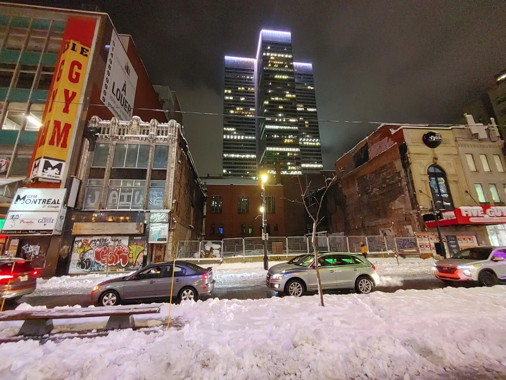

<dl>
<dt>District</dt><dd>Downtown</dd>
<dt>Type</dt><dd>Archbishop's seat of power</dd>
<dt>Claimed By</dt><dd>Archbishop [Valez](/npcs/carolina-valez/)</dd>
<dt>City</dt><dd>Montreal</dd>
</dl>

## Physical Read

- A former luxury hotel converted to a shopping center in the 1980s. Five stories of marble, brass, and skylit atria. During the day, mortals shop for things they can't afford. After hours, the building belongs to [Valez](/npcs/carolina-valez/).
- The Archbishop's quarters occupy the upper floors, sealed off by locked stairwells and ghouls who don't ask questions. The rooms retain the hotel's original grandeur — crown molding, parquet floors, chandeliers that cast light on walls that have absorbed screaming.
- The contrast is the point. Gilded authority over a shopping mall. The Sabbat version of the Camarilla's Elysium, except here the violence is not hidden but deferred.

## Function in Play

- The Archbishop's court. Where [Valez](/npcs/carolina-valez/) holds audiences, issues decrees, and reminds everyone who owns the city.
- The coterie comes here when summoned. Nobody comes here voluntarily.
- Political barometer for the Sabbat power structure. Watch who enters, who waits, who leaves quickly and who doesn't leave at all.

## Who Controls It

- Valez. Completely and without ambiguity. The building is his territory, his court, his statement.
- Ghouls manage building security and control mortal access to the upper floors.
- Visiting Bishops and pack leaders are guests, never residents. Valez does not share space.
