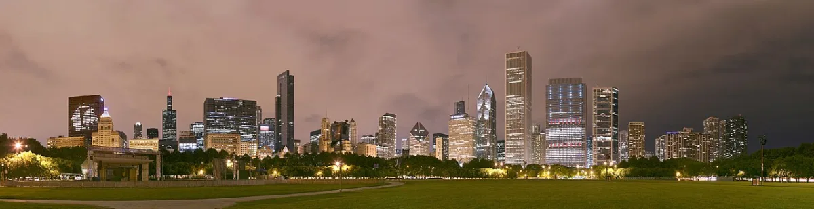

<dl>
<dt>District</dt><dd>Loop / Michigan Avenue</dd>
<dt>Type</dt><dd>Prince's official seat of power</dd>
<dt>Claimed By</dt><dd>[Lodin](/npcs/lodin/)</dd>
<dt>City</dt><dd>Chicago</dd>
</dl>

## Physical Read

- Executive suite decor stripped of personality. Expensive furniture chosen by someone who wanted to project power, not taste. Mahogany. Brass. Thick carpet that swallows footsteps.
- Floor-to-ceiling windows overlooking the lake. At night the glass becomes a black mirror. You see yourself and nothing else.
- The air smells faintly of leather conditioner and nothing organic. No food, no flowers, no sweat. A room that has forgotten what living things need.

## Function in Play

- The front door of [Lodin](/npcs/lodin/)'s authority. Corporate fortress in the upper floors of the Prudential Building.
- Where summons are received, loyalty is tested, and neonates learn what a Prince's displeasure looks like.
- The real haven is elsewhere. This is the mask the mask wears.

## Geographic Placement

- **Address:** Prudential Building, 130 East Randolph Street, 34th floor. Nine rooms in a 3x3 grid, corridor from elevator in the SE corner running north. Central room is the vault with handprint access.
- **Neighborhood:** The Loop (The Hive), northeast edge. Short distance from Daley Center / City Hall to the west. Michigan Avenue frontage with lake views.
- **Proximity:** Roughly one mile northeast of the [Sears Tower](/locations/sears-tower/) ([Lodin](/npcs/lodin/)'s true haven). The [Art Institute](/locations/art-institute/) is a few blocks south on Michigan. The Rack and [Succubus Club](/locations/succubus-club/) are north across the Chicago River.
- **Transit:** CTA Red/Blue Line to Washington or Randolph. The Loop elevated tracks pass within two blocks. Lake Shore Drive accessible one block east. Metra stations at Millennium and Randolph.

## Who Controls It

- Lodin directly, through layers of corporate shells, property management firms, and a security company staffed by ghouls.
- His retainer [Julian Curry](/npcs/julian-curry/) handles mortal-facing logistics. [Curry](/npcs/julian-curry/) is efficient, frightened, and loyal in the way a man is loyal to the thing that could destroy him.
- During the Ashes to Ashes crisis, this haven is a decoy. Lodin is not here. He may not be anywhere.
