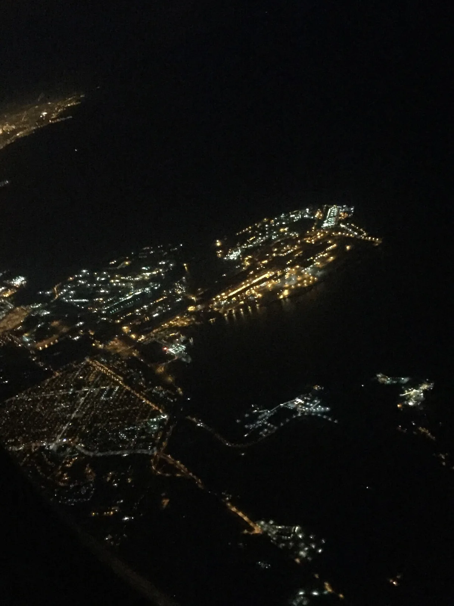

<dl>
<dt>District</dt><dd>East Chicago harbor / Buffington corridor</dd>
<dt>Type</dt><dd>Docks and smuggling corridor</dd>
<dt>Claimed By</dt><dd>[Lucian](/npcs/lucian/)</dd>
<dt>Theme</dt><dd>Industrial Predation</dd>
<dt>Mood</dt><dd>Sodium-lit exposure, cold wind, and disciplined threat</dd>
<dt>City</dt><dd>Gary</dd>
</dl>

## Physical Read

- Freighters, cranes, container yards, rail spurs, lake wind, sodium lights, and men who know when not to ask questions.
- Industrial order sits on top of corruption rather than replacing it.

## Function in Play

- The pipeline target and one of the most dangerous places in the chronicle.
- Best for labor intrigue, smuggling, freight surveillance, and elder pressure.

## Who Controls It

- Lucian through dock labor, management influence, and fear.
- Gary Exports Co. provides the hidden lane for illicit traffic.
