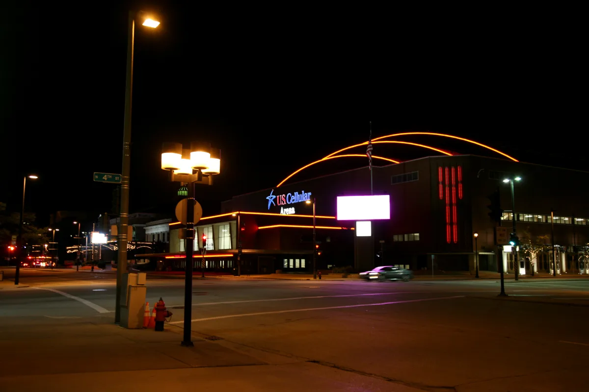

<dl>
<dt>District</dt><dd>[West Downtown](/locations/west-downtown/)</dd>
<dt>Type</dt><dd>Convention center, Elysium</dd>
<dt>Claimed By</dt><dd>Primogen Council (Elysium)</dd>
<dt>City</dt><dd>Milwaukee</dd>
</dl>

## Physical Read

- A large, modern civic building at 500 W Kilbourn Ave. Convention halls, meeting rooms, arena space.
- Connected to the Hyatt Regency via the skywalk system — enclosed pedestrian bridges above street level.
- At night, the Kindred use reserved sections. The building's public events provide cover for the gatherings.
- The meeting spaces feel institutional — fluorescent lighting, municipal carpet, cheap chairs. The grandeur of Elysium applied to government-issue furniture.
- Better than it sounds. Neutral ground that looks boring is neutral ground nobody fights over.

## Function in Play

Milwaukee's Elysium. The neutral ground where the Primogen Council meets, announcements are made, and the fiction of civilized governance is maintained. No violence permitted. The prohibition is enforced by tradition and [Lucina](/npcs/lucina/)'s authority. How long that holds depends on how the clocks move.

## Who Controls It

- Lucina maintains Elysium protocol and venue access.
- The Primogen Council convenes here. All seven representatives attend in theory.
- No single faction dominates. That is the point.
