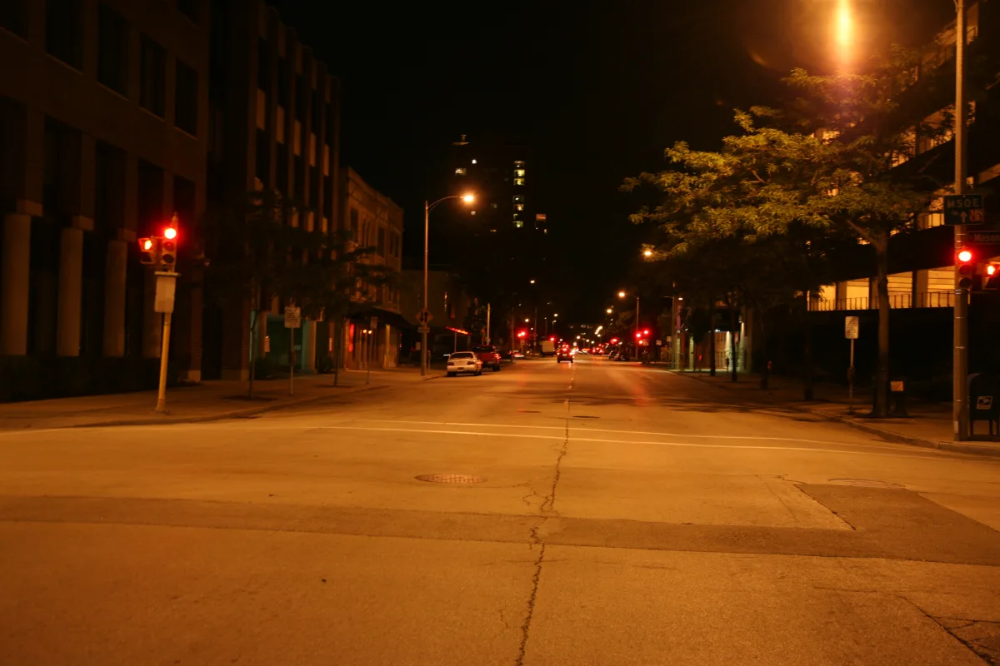

<dl>
<dt>District</dt><dd>[West Downtown](/locations/west-downtown/)</dd>
<dt>Type</dt><dd>Prince's haven, high-rise penthouse</dd>
<dt>Claimed By</dt><dd>Prince [Terence Merik](/npcs/terence-merik/)</dd>
<dt>City</dt><dd>Milwaukee</dd>
</dl>

## Physical Read

- Top-floor penthouse with panoramic views of Milwaukee and Lake Michigan.
- Expensive, sterile. The furnishings suggest taste but the arrangement suggests a man who no longer notices his surroundings.
- His wife's possessions are still in the closets. He burned her body but kept her things.
- Somewhere in here: evidence. Trophies, blood, records of movements that match the murder timeline.

## Function in Play

The lair of the killer. [Merik](/npcs/terence-merik/)'s penthouse sits atop a [West Downtown](/locations/west-downtown/) high-rise and functions as both the seat of princely authority and the private space where the mask comes off. If the investigation leads here, it means the coterie has already decided to move against the Prince.

## Who Controls It

- [Merik](/npcs/terence-merik/). Absolutely. Ghouls provide security. The building staff is Dominated or paid.
- No other Kindred visits without invitation.
