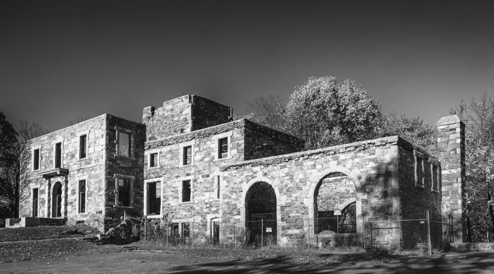

<dl>
<dt>District</dt><dd>Emerson / north Midtown seam</dd>
<dt>Type</dt><dd>Court and primary haven</dd>
<dt>Claimed By</dt><dd>[Modius](/npcs/modius/)</dd>
<dt>Theme</dt><dd>The Illusion of Sovereignty</dd>
<dt>Mood</dt><dd>Stale grandeur, polite dread, and low-frequency panic</dd>
<dt>City</dt><dd>Gary</dd>
</dl>

## Physical Read

- Decaying steel-baron mansion trying to remember what prestige felt like.
- Buckets under leaks, moth-eaten grandeur, classical music, ruined paintings, basement sleeping quarters.

## Function in Play

- The city's official court and the place where politeness becomes surveillance.
- Best used for etiquette scenes, veiled threats, haven questions, and emotional traps.

## Who Controls It

- Modius directly.
- [Allicia](/npcs/allicia/) shapes the emotional climate.
- Dominated union stewards supply muscle and visible order.
