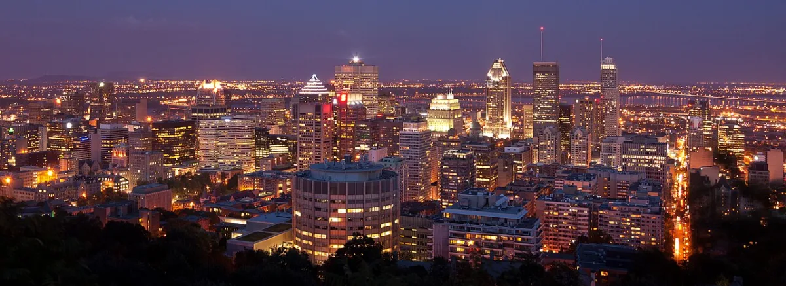

<dl>
<dt>District</dt><dd>City center (parkland)</dd>
<dt>Type</dt><dd>Failed Creation Rites site and supernatural dead zone</dd>
<dt>Claimed By</dt><dd>Metathiax (contested)</dd>
<dt>City</dt><dd>Montreal</dd>
</dl>

## Physical Read

- A forested mountain rising from the center of the city. Olmsted's park overlaid on terrain that was sacred to the Haudenosaunee long before Europeans arrived.
- By day, it's a public park. Joggers, cyclists, families at Beaver Lake. The Chalet lookout provides a panoramic view of downtown. Normal. Pleasant. Safe.
- After dark, the mountain changes. The ancient tree canopy blocks the city light entirely. The trails narrow into dirt paths that don't appear on park maps. The temperature drops in places where it shouldn't. The Cross on the summit — illuminated, visible from anywhere in the city — casts shadows that move against the wind. The trees whisper in a voice that is not the wind. The earth can swallow vampires whole. Feral thralls — twisted Sabbat buried on the mountain — travel through subterranean arteries in the soil.

## Function in Play

- The place where rituals go wrong. The mountain has been used for Creation Rites, Thaumaturgical workings, and ceremonies that left residue in the soil.
- A supernatural dead zone. Disciplines behave unpredictably here. Auspex returns noise instead of signal. Thaumaturgy misfires.
- Metathiax's domain — whatever Metathiax is. The mountain is claimed by something that the Sabbat hierarchy acknowledges without understanding.

## Who Controls It

- Metathiax. The name circulates among Sabbat elders with the specific tension reserved for things they cannot categorize or destroy.
- The failed Creation Rites have left the mountain's soil saturated with vitae and spiritual contamination. Something feeds on the failures.
- Sabbat packs avoid the mountain after midnight unless ordered there. The avoidance is not official policy. It's survival instinct.
