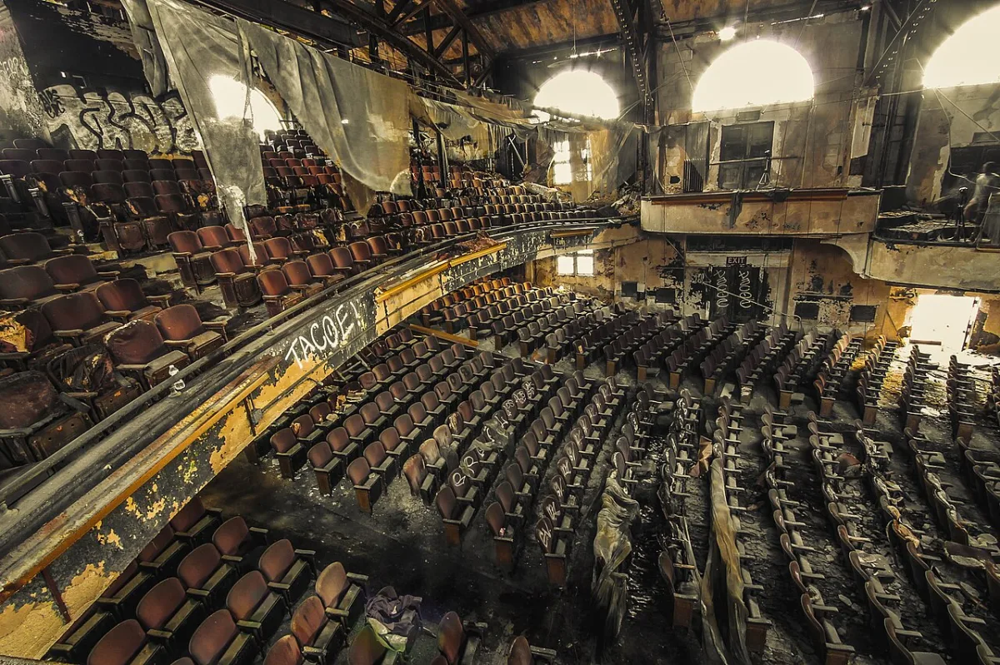

<dl>
<dt>District</dt><dd>Downtown</dd>
<dt>Type</dt><dd>Mage haunt / crossover point</dd>
<dt>Claimed By</dt><dd>Hollow Ones (mages)</dd>
<dt>City</dt><dd>Gary</dd>
</dl>

## Physical Read

- The Royal Palace Theatre. Abandoned since the 1970s. Marquee letters missing or hanging crooked. Lobby carpet rotted through to the concrete. Auditorium seats ripped out or collapsed. The screen is still there, stained and sagging.
- The Hollow Ones have cleaned a section of the balcony and the projection booth. They show old movies on the ruined screen using a salvaged projector. The light cuts through decades of dust and makes the empty theater feel like a cathedral for dead entertainment.
- Smells like mildew, old popcorn grease baked into the walls, and candle wax.

## Function in Play

- The crossover point. A Mage cabal operating inside Gary's ruins, unknown to most Kindred, known to a few.
- The Kindred plan to Blood Bond them. If that succeeds, Gary gains a captive magical asset. If it fails, the Hollow Ones become enemies with Sphere magic and nothing to lose.
- Where Mage and Vampire intersect in the chronicle. Handle with care or do not handle at all.

## Who Controls It

- The Hollow Ones cabal: Crystal Spinner, Marvin Hafuer, Klenton McKay. Two acolytes: Julie Pratt and Dwaine Smith.
- They know Juggler and Michael. Those are the only Kindred connections.
- No Kindred formally claims the building. It exists in a gap between territories.
