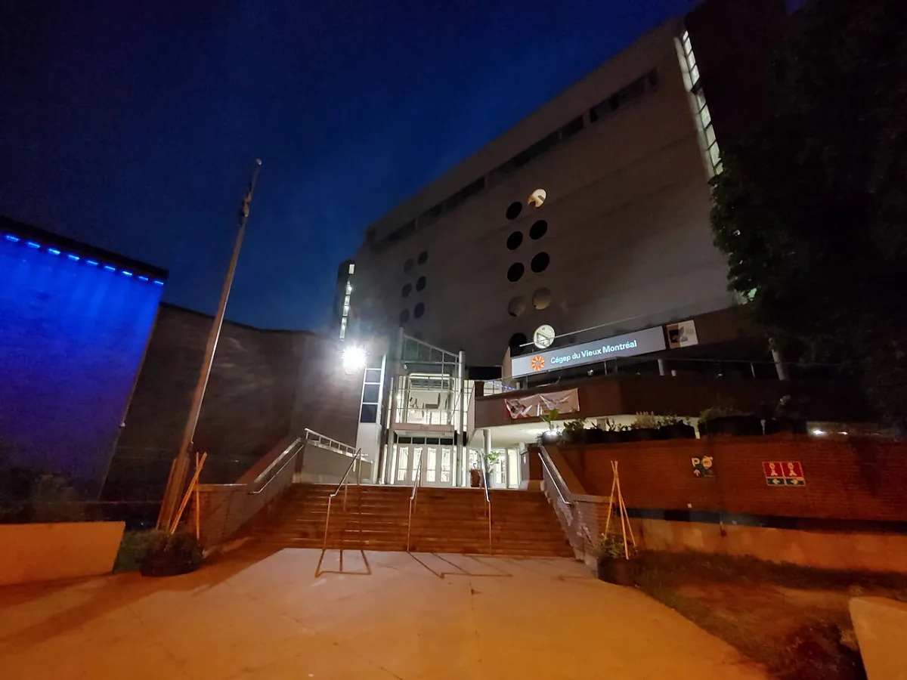

<dl>
<dt>District</dt><dd>Old Montreal</dd>
<dt>Type</dt><dd>Historic district and ambush territory</dd>
<dt>Claimed By</dt><dd>Contested</dd>
<dt>City</dt><dd>Montreal</dd>
</dl>

## Physical Read

- Cobblestone streets barely wide enough for modern cars. Seventeenth-century stone buildings pressed shoulder to shoulder, their facades restored for tourists and their interiors rotting behind the plaster.
- Notre-Dame Basilica dominates Place d'Armes at 110 Notre-Dame West, its twin towers lit blue at night. The square in front of it is open ground — exposed, nowhere to hide, nowhere to run except into the side streets where the light doesn't reach. The Basilica is impassable to all Kindred. No vampire has ever set foot inside. The aura of Faith is beyond explanation.
- Secret passages in the older buildings. Smuggler's routes from the fur trade era, converted to storage and forgotten. [Chinatown](/locations/chinatown/) presses against Old Montreal's northern edge — three blocks of small stores and cheap apartments, riddled with its own tunnel network from former gambling dens and brothels, linked by tunnel to the communal haven.

## Function in Play

- Ambush territory. The narrow streets, blind corners, and layered architecture make Old Montreal the most dangerous district to cross at night.
- A contested zone where no single pack holds unchallenged dominion. Transit through here is a calculated risk.
- The historical weight of the district matters. Four centuries of colonization, commerce, and decay compressed into cobblestone blocks. The architecture remembers things the city has tried to forget.

## Who Controls It

- No one, which is why it's dangerous. Multiple packs claim sections. The boundaries shift. Territorial disputes are settled with violence, not negotiation.
- The historic designation limits construction, which means the physical landscape doesn't change. The Kindred who have been here longest know every passage, every dead-end, every rooftop crossing.
- Mortal police patrol the tourist areas. They don't patrol the back streets after midnight.
