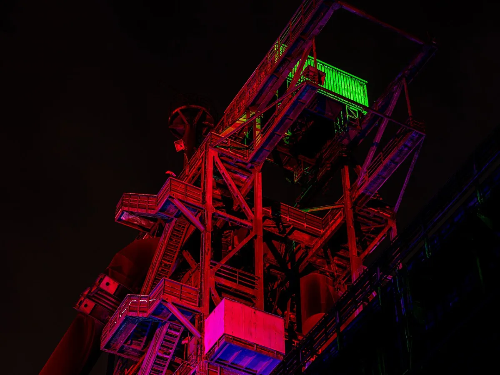

<dl>
<dt>District</dt><dd>Lakefront mill belt / Wasteland</dd>
<dt>Type</dt><dd>Abandoned ore smelter haven</dd>
<dt>Claimed By</dt><dd>Juggler and Chicago anarchs</dd>
<dt>City</dt><dd>Gary</dd>
</dl>

## Physical Read

- Huge dead industrial shell of catwalks, rust, dust, slag, and echo.
- The kind of place where firelight feels older than electricity.

## Function in Play

- The anarch stronghold and the best place in Gary to lose control of a situation.
- Use it for confrontations, gang politics, hidden monsters, and sudden alliances.

## Who Controls It

- Juggler through reputation and violence.
- Peripheral gangs and dumped anarchs make the space feel larger than one haven.
