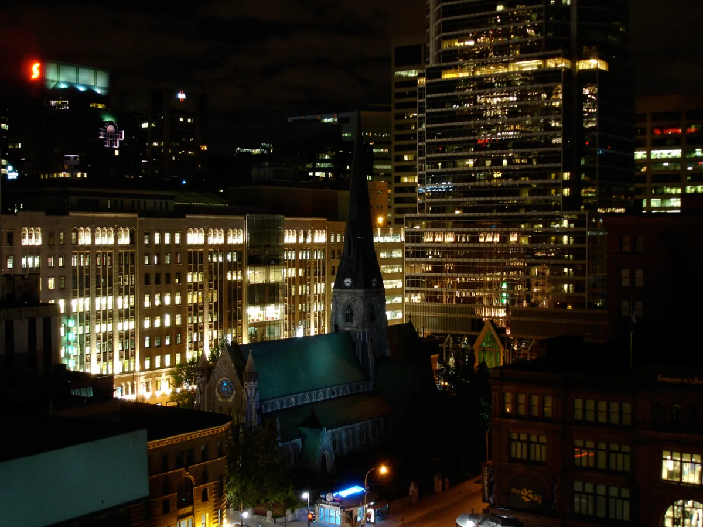

<dl>
<dt>District</dt><dd>Downtown</dd>
<dt>Type</dt><dd>Underground mall and daytime shelter</dd>
<dt>Claimed By</dt><dd>Sabbat (communal daytime shelter)</dd>
<dt>City</dt><dd>Montreal</dd>
</dl>

## Physical Read

- A shopping mall built directly beneath Christ Church Cathedral in the 1980s. The cathedral sits on concrete pillars above the retail space. Engineering over theology. Gothic motif throughout — dark stone walls, vaulted ceilings, stone carvings and statues giving the interior a cavernous ambience.
- Fluorescent-lit corridors lined with clothing stores, food courts, and the blank-faced retail of any North American mall. During business hours, it's aggressively normal. Mortals buying shoes while the undead sleep in the utility spaces behind the walls. The central area beneath the cathedral proper is a hanging garden — no retail, just plants and the uneasy knowledge of what sits above.
- The utility corridors branch off from the main concourse at service doors marked "Personnel Only." Behind them: mechanical rooms, storage, electrical closets. Small, lightless spaces where a Kindred can pass the day if they don't mind sleeping upright next to circuit breakers.

## Function in Play

- Daytime shelter for Sabbat Kindred caught above ground when the sun approaches. The underground mall provides sunlight-free transit and temporary rest.
- The irony is structural: Sabbat Kindred sheltering beneath Christ Church Cathedral, the Anglican seat of Montreal. The dead hiding under the house of God.
- Commerce hub that connects to the [Underground City](/locations/underground-city/) network. A waypoint, not a destination.

## Who Controls It

- No single Kindred claims the Promenades. It functions as communal Sabbat infrastructure — everyone uses it, nobody owns it.
- The Underground City connections make it valuable as a transit node. [Elias the Whale](/npcs/elias-the-whale/)'s influence extends here through the tunnel network.
- Mall security is mortal and oblivious. The Sabbat presence exists in the margins — the utility spaces, the after-hours corridors, the places where mortal attention doesn't reach.
