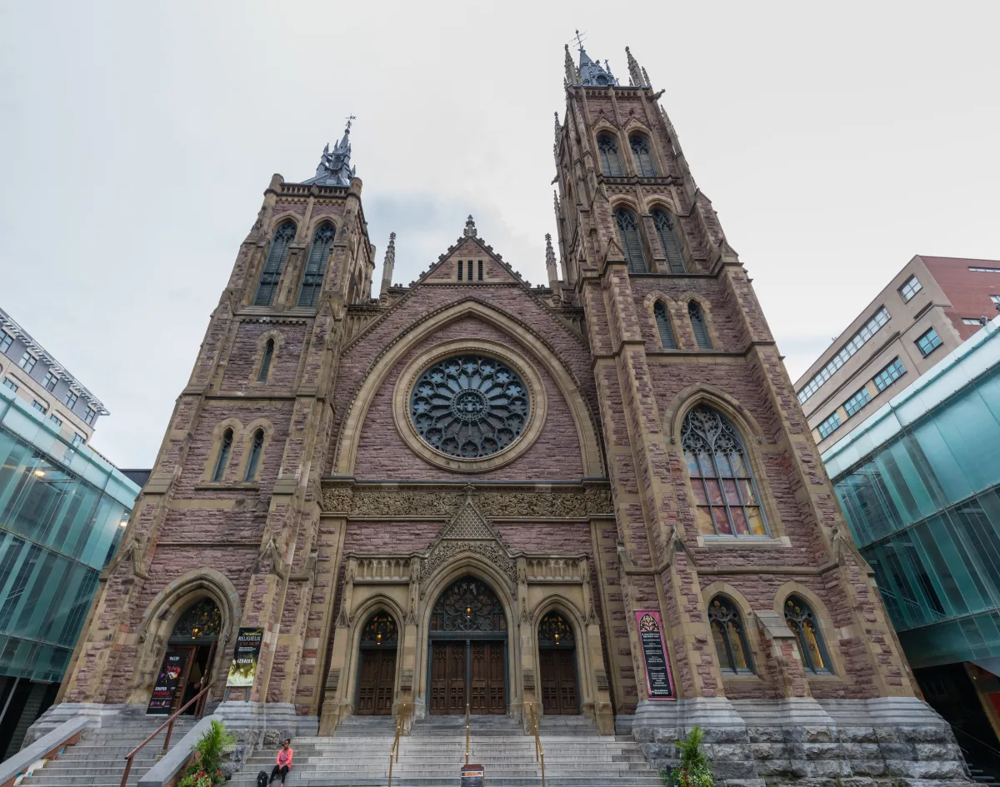

<dl>
<dt>District</dt><dd>Downtown</dd>
<dt>Type</dt><dd>Corpse disposal site</dd>
<dt>Claimed By</dt><dd>Sabbat (communal disposal site)</dd>
<dt>City</dt><dd>Montreal</dd>
</dl>

## Physical Read

- A stone church on Sainte-Catherine West that stopped holding services years ago. The diocese abandoned it. The city forgot it. The Sabbat found it.
- The nave is stripped bare. Pews sold off or burned. What stained glass remains is filthy, filtering streetlight into murky colors that make everything look bruised. Most of the good glass was stolen years before the Sabbat arrived.
- The basement is the operating theater. Pieces of five hundred or more corpses in various states of decomposition, including staked Cainites who failed Creation Rites. The smell is beyond chemical remediation. Lye, industrial cleaning supplies, plastic sheeting. Functional, not ceremonial.

## Function in Play

- Where the Sabbat bring bodies. The end of the line for Masquerade cleanup, failed Creation Rites, and anyone who stopped being useful.
- A grim utility location. Scenes here involve the worst parts of the unlife.
- Evidence of Sabbat operations accumulates in the basement. A liability waiting to detonate.

## Who Controls It

- No single Kindred claims it. The church belongs to the Sabbat collectively, maintained by whichever pack drew cleanup duty that week.
- Packs treat disposal detail as punishment or hazing. The newest members get the worst assignments.
- The lack of singular authority means the site is poorly maintained and poorly secured. A vulnerability.
