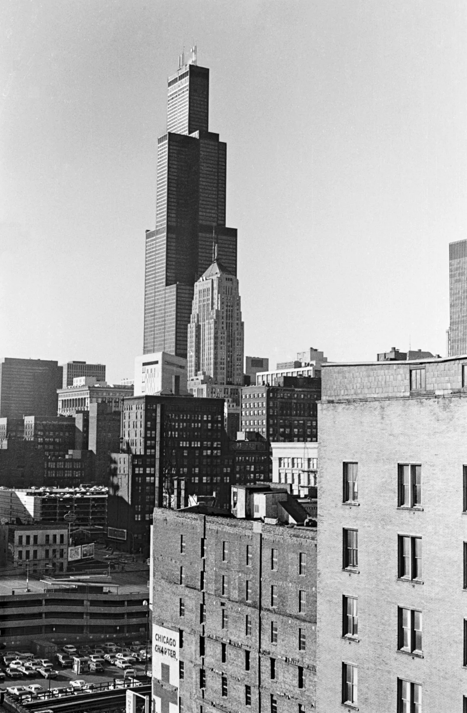

<dl>
<dt>District</dt><dd>Loop / West Side</dd>
<dt>Type</dt><dd>Prince's true haven</dd>
<dt>Claimed By</dt><dd>[Lodin](/npcs/lodin/)</dd>
<dt>City</dt><dd>Chicago</dd>
</dl>

## Physical Read

- The 107th floor is unlisted. Elevator access requires a bypass that [Lodin](/npcs/lodin/)'s people installed decades ago. The corridor beyond is narrow, windowless, and smells like recycled air and old blood.
- The vault door is steel and concrete, designed to resist shaped charges. It has been torn from its frame like paper. The hinges are sheared. Metal filings glitter on the floor.
- Inside: a coffin, a communications suite, weapons, files, and Julian Curry's body. Whatever happened here was fast. Curry died trying to get to the phone.

## Function in Play

- [Lodin](/npcs/lodin/)'s actual haven. 107th floor. The place nobody is supposed to find.
- The Ashes to Ashes investigation leads here. The seven-ton vault door has been ripped open by something with Blood-fueled Potence. Whatever did this was stronger than the Prince.
- Julian Curry is dead inside. The trail goes cold or gets much worse, depending on what [Darius](/darius-cole/) does with what he finds.

## Geographic Placement

- **Address:** 233 South Wacker Drive (fills a full city block at [Jackson](/npcs/kevin-jackson/) Blvd and Wacker). Built 1974, 110 stories, 1,454 feet — tallest building in the world in 1992. [Lodin](/npcs/lodin/)'s haven occupies the 107th floor (third from the top). The 95th floor holds a secondary haven with the same 3x3 nine-room layout as the Prudential.
- **Neighborhood:** The Loop (The Hive), southwest edge. The indoor plaza at street level is vast and spectacular, with double-decker express elevators.
- **Proximity:** Roughly one mile southwest of [Lodin](/npcs/lodin/)'s Prudential Building (130 E Randolph). Union Station is two blocks south — [Edgar Drummond](/npcs/edgar/)'s railroad marshalling-yards are beyond it. The [Art Institute](/locations/art-institute/) and Michigan Avenue are six blocks east.
- **Transit:** CTA Blue/Brown/Orange/Pink/Purple Lines all serve the Loop elevated within two blocks. The Quincy and [Jackson](/npcs/kevin-jackson/) stops are closest. Express elevator bypass from the lobby is the only Kindred route to 107.

## Who Controls It

- [Lodin](/npcs/lodin/) controlled it. Past tense may apply.
- Building management has no record of the 107th floor's true tenant. The lease is held through a trust that routes through three shell companies.
- After the breach, whoever finds this place controls the biggest secret in Chicago.
