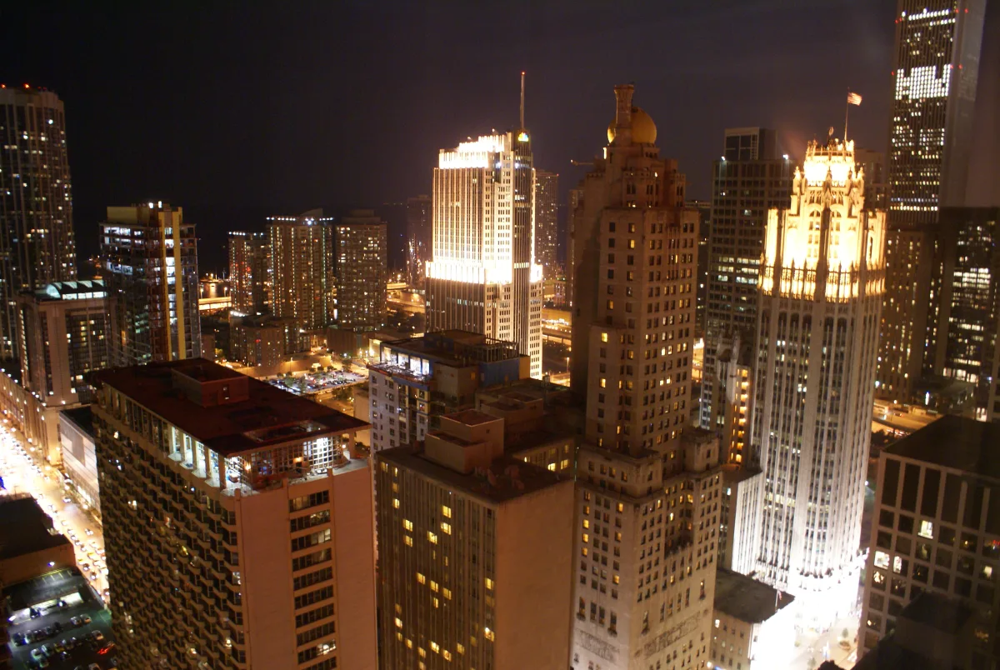

<dl>
<dt>District</dt><dd>Near North / Rush Street</dd>
<dt>Type</dt><dd>Kindred nightclub and social nexus</dd>
<dt>Claimed By</dt><dd>Brennon Thornhill (officially), Helena (secretly)</dd>
<dt>City</dt><dd>Chicago</dd>
</dl>

## Physical Read

- Three levels of engineered decadence: the ground floor throbs with industrial music and mortal cattle, the mezzanine hosts private booths where elders watch the floor like hawks over a field, and the VIP level smells of old money and cold skin.
- Lighting designed to flatter the dead. Strobes mask pale complexions. Bass frequencies you feel in your sternum.
- Below all of it, a sealed sub-basement that doesn't appear on any blueprint. Stone walls. Climate-controlled air. The kind of quiet that costs centuries to build.

## Function in Play

- The crossroads of Chicago Kindred politics. Every clan, every faction, every grudge passes through this room.
- Where Darius gathers intelligence, makes contacts, and risks exposure in equal measure.
- The sub-basement vault is Helena's domain. Nobody gets down there without her permission or a death wish.

## Geographic Placement

- **Address:** State Street, Near North Side — west of Rush Street, in the heart of the Rack. The ancient four-story brick warehouse is the first four-story warehouse built in Chicago, pre-Civil War construction. Survived the Great Fire of 1871.
- **Neighborhood:** The Rack / Near North. Six to eight blocks of nightlife. The Blue Velvet sits on the same stretch of State Street. The Cave is two blocks north.
- **Proximity:** Two blocks south of the Cave. Adjacent to the x-rated movie district on Dearborn, Clark, and LaSalle. Daley's Restaurant and the Brewery are a short walk north on State. The Loop and Lodin's Prudential Building are south across the Chicago River.
- **Transit:** CTA Red Line to Chicago/State or Grand/State. Cab traffic heavy on Rush and State after dark. Lake Shore Drive accessible eastbound via Division or North Avenue.

## Who Controls It

- Thornhill runs the floor, handles the mortal staff, keeps the liquor license clean.
- Helena owns the building, the land, and every secret that passes through the walls. She has been here longer than Chicago has had a name.
- Kindred who think they own a piece of the Succubus Club own nothing. They rent tolerance.
