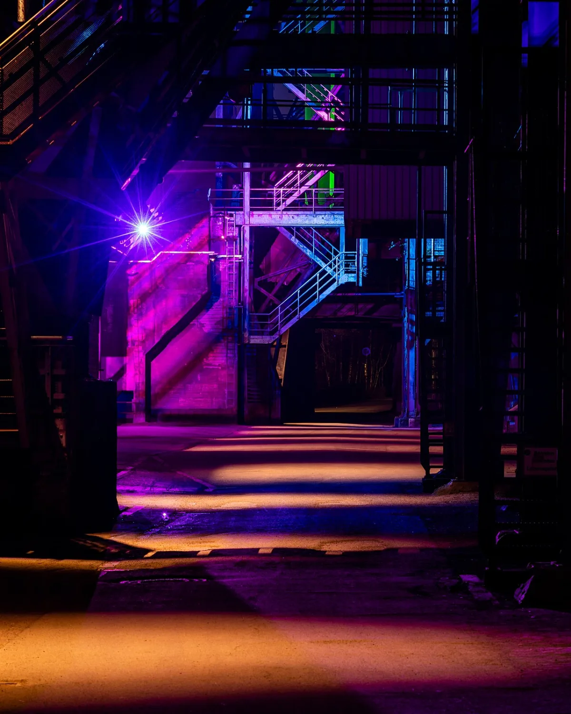

<dl>
<dt>District</dt><dd>Lakefront plant strip</dd>
<dt>Type</dt><dd>Fallback haven</dd>
<dt>Claimed By</dt><dd>[Modius](/npcs/modius/)</dd>
<dt>City</dt><dd>Gary</dd>
</dl>

## Physical Read

- Old taconite processing space close to the shore, half-industrial ruin and half hidden bunker.
- Wind, rust, steel dust, and machinery too dead to sound safe.

## Function in Play

- [Modius](/npcs/modius/)'s emergency bolt-hole.
- Good for scenes where his polish drops and survival instinct replaces ceremony.

## Who Controls It

- Modius and whichever retainers he trusts enough to know it exists.
