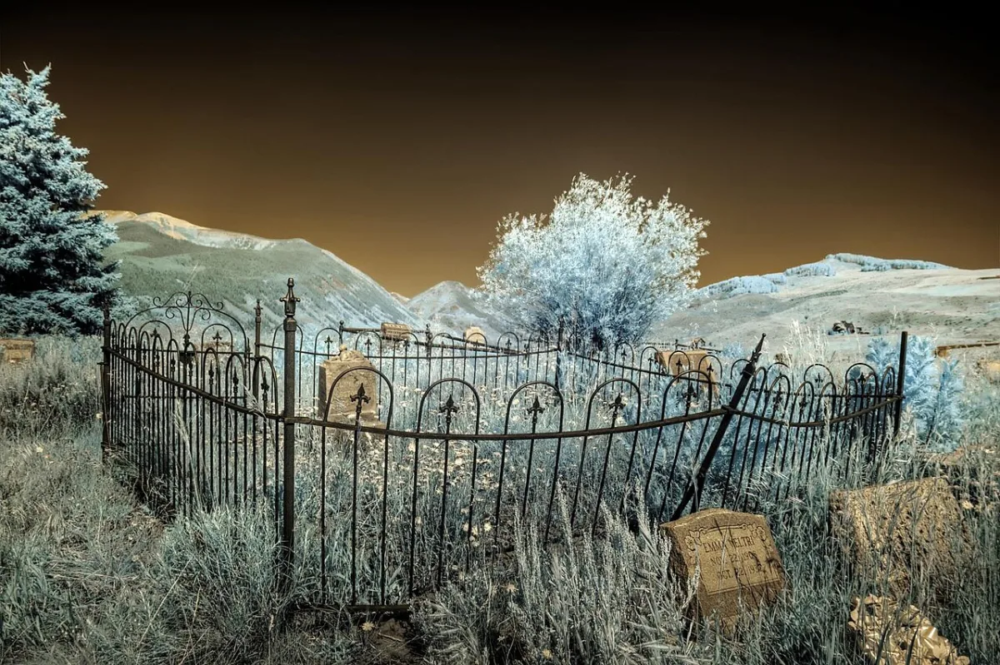

<dl>
<dt>District</dt><dd>Tolleston / Grant belt</dd>
<dt>Type</dt><dd>Cemetery and mausoleum domain</dd>
<dt>Claimed By</dt><dd>Michael</dd>
<dt>City</dt><dd>Gary</dd>
</dl>

## Physical Read

- Older cemetery texture, winter grass, stone, mausoleum shadow, and the feeling of being forgotten on purpose.

## Function in Play

- The city's quietest supernatural node.
- Best for slow trust-building, Dane surveillance, and melancholy scenes.

## Who Controls It

- Michael through familiarity, stealth, and the simple fact that most people do not want to linger.
