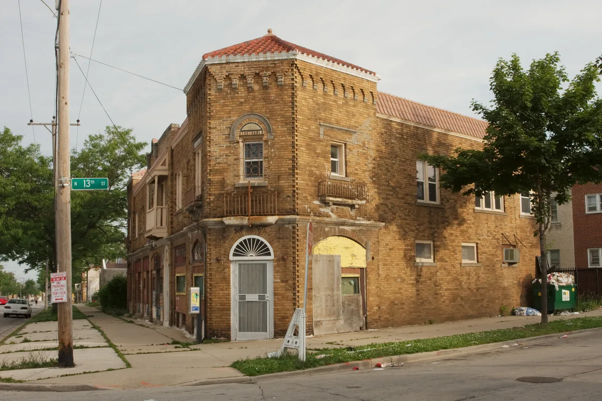

<dl>
<dt>District</dt><dd>Inner suburbs</dd>
<dt>Type</dt><dd>Urban no-man's-land</dd>
<dt>Claimed By</dt><dd>Unclaimed</dd>
<dt>City</dt><dd>Milwaukee</dd>
</dl>

## Physical Read

- Boarded-up houses, knee-high weeds growing through cracked sidewalks, cyclone fencing around nothing.
- The industrial skeleton of a city that was larger once. Factories and warehouses along the Menomonee River Valley that employed people who no longer live here.
- The character shifts by sector: the north side near [Graceland Cemetery](/locations/graceland-cemetery/) feels residential and abandoned; the near west side near Marquette feels institutional and wrong; the south side near Mitchell Airport feels industrial and watched.
- At night, it is quiet in a way that makes predators comfortable. The mortal population that remains is invisible by choice — they do not want to be found, which makes them vulnerable to things that hunt.
- Sewer grates and tunnel access points scattered throughout. The underground here is [Demetri](/npcs/demetri/)'s domain.

## Function in Play

The dead ground between the city Kindred hold and the border the Anubi defend. Abandoned houses, shuttered businesses, empty lots. Milwaukee's version of Gary's Wasteland. Nobody claims the Barrens because claiming them means defending them, and the Barrens are not worth the cost. Feeding is possible among the homeless, the addicted, and the people who fell through the cracks. Demetri's tunnel network runs beneath parts of it.

## Who Controls It

- Nobody. The Barrens are a vacuum.
- Demetri operates in the tunnels beneath — the sewer and storm drain network that feeds into the Menomonee River Valley. He does not control the surface.
- [Parovich](/npcs/parovich/) uses dead drops in the Barrens for Sabbat communication. His condemned house is in the inner south side.
- [Lisa Urgen](/npcs/lisa-urgen/) moves through here. Hunters prefer terrain where witnesses are absent.
- [Jacob](/npcs/jacob-the-glitch/) holds his Greendale mansion at the far southern edge. Esau keeps a condo north of downtown — they bracket the Barrens between them.
