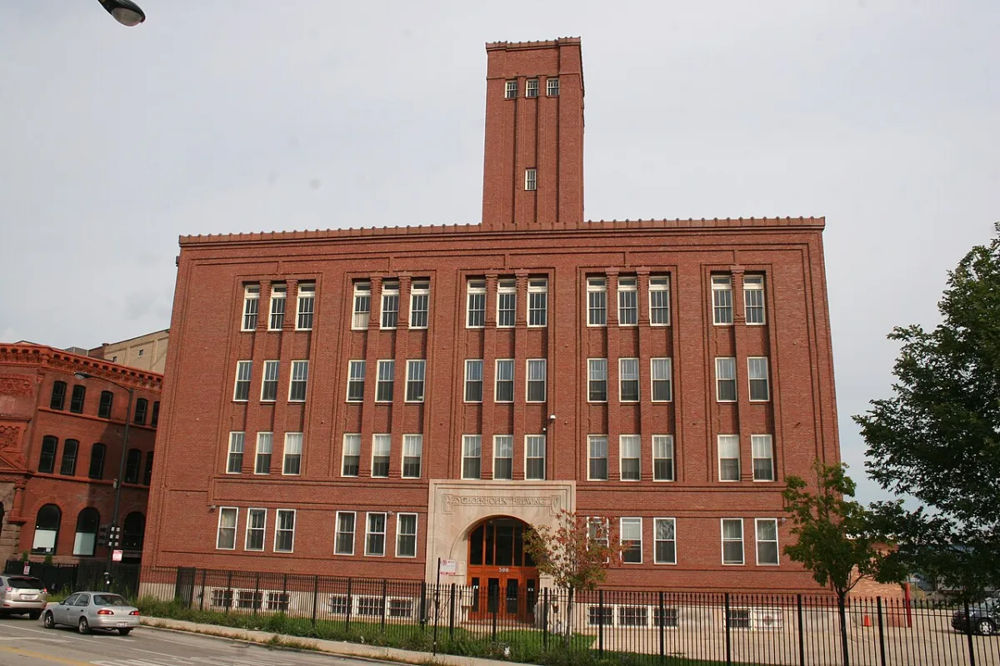

<dl>
<dt>District</dt><dd>North Side</dd>
<dt>Type</dt><dd>Anarch headquarters</dd>
<dt>Claimed By</dt><dd>[Gengis](/npcs/gengis/)</dd>
<dt>City</dt><dd>Chicago</dd>
</dl>

## Physical Read

- Abandoned brewery. Brick shell with the roof partially caved in the east wing. Concrete floors stained with decades of fermentation runoff. The yeast smell never left.
- [Gengis](/npcs/gengis/) holds meetings in the old bottling room where the acoustics carry voices whether you want them to or not.
- Crates, barrels, sleeping bags, stolen furniture. Someone welded a fire pit from an oil drum. Graffiti on every wall, some of it political, some of it territorial, some of it just bored.

## Function in Play

- Where the anarchs plan, argue, and fail to agree on what happens next.
- The place [Darius](/darius-cole/) goes when he wants to know what the discontented are building, and how close it is to collapsing.
- Fire hazard. [Belthazar](/npcs/belthazar/) has threatened to burn the building. The anarchs store accelerants for Molotovs. One bad night and the whole block goes up.

## Geographic Placement

- **Address:** North Clark Street, facing onto Dearborn, Near North Side. Three-story brick building. All windows bricked up, all doors chained or boarded. Only entrance is on the roof.
- **Neighborhood:** Near North, between Rush Street and Dearborn, in the transition zone between the Rack's nightlife and the residential blocks north of it.
- **Proximity:** Physically adjacent to [Daley's Restaurant](/locations/daleys-restaurant/) (1000 block N State) — you can jump from Daley's roof to the Brewery's roof. The [Succubus Club](/locations/succubus-club/) and [the Cave](/locations/the-cave/) are a few blocks south on State Street. [Ballard](/npcs/ballard/)'s power-dining venue and the Anarch HQ share a wall.
- **Transit:** CTA Red Line to Clark/Division. Street access from Clark, but the bricked-up facade gives nothing away. Fire escape access from Daley's rooftop provides the covert route.

## Who Controls It

- [Gengis](/npcs/gengis/) by force of personality and the fact that nobody else wants the job.
- [Damien](/npcs/damien/) agitates from within. He wants action. [Gengis](/npcs/gengis/) wants patience. The argument never resolves, it just recycles.
- Other anarchs drift in and out. Loyalty is situational. The Brewery is a meeting place, not a fortress.
