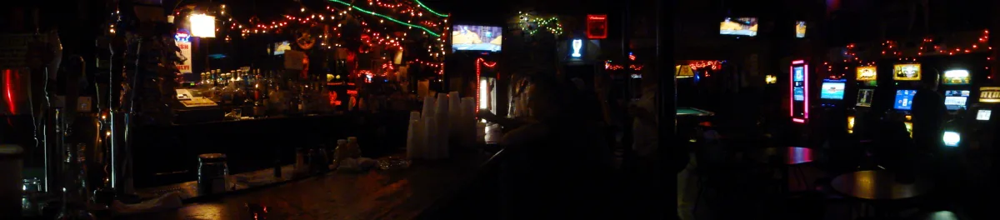

<dl>
<dt>District</dt><dd>Near North / below street level</dd>
<dt>Type</dt><dd>Malkavian bar</dd>
<dt>Claimed By</dt><dd>[Horace](/npcs/horace/)</dd>
<dt>City</dt><dd>Chicago</dd>
</dl>

## Physical Read

- Below street level. Stairs down from a door that looks condemned. Inside: low ceilings, exposed brick, candles in bottles, the smell of spilled beer and mildew.
- No windows. The walls sweat. Someone has painted murals that shift meaning depending on how long you stare at them.
- Houdini's stage is a plywood platform under a bare bulb. He lets mortals tie him to a chair with rope and a sharpened dowel over his heart. He always escapes. The mortals think it's a trick.

## Function in Play

- Chicago's strangest information market. What you hear in the Cave may be prophecy, delusion, or both, and no one will tell you which.
- A place to feed on mortals who came looking for something weird and found it.
- Houdini does stake-escape tricks on a small stage. The audience laughs. The Kindred in the room do not.

## Geographic Placement

- **Address:** State Street, Near North Side — two blocks north of the [Succubus Club](/locations/succubus-club/). Basement bar beneath street level, accessed by steps down from a dirty, unlit sign. Fifteen-foot hallway with antique door knockers before the main room.
- **Neighborhood:** The Rack / Near North. Same State Street corridor as the Succubus Club and the [Blue Velvet](/locations/blue-velvet/). The x-rated movie district on Dearborn and Clark is one block west.
- **Proximity:** Two blocks north of the Succubus Club. Within walking distance of [Daley's Restaurant](/locations/daleys-restaurant/) (1000 block N State) and [the Brewery](/locations/the-brewery/) (N Clark). South of Division Street.
- **Transit:** CTA Red Line to Chicago/State. Street-level entrance is easy to miss on foot and impossible to find by accident from a car.

## Who Controls It

- Horace owns the space and sets the tone. His authority is the kind that comes from everyone agreeing not to test it.
- Malkavians drift through. Some are regulars. Some appear once and are never seen again.
- Non-Malkavian Kindred are tolerated as long as they buy drinks and don't start asking pointed questions about what's real.
