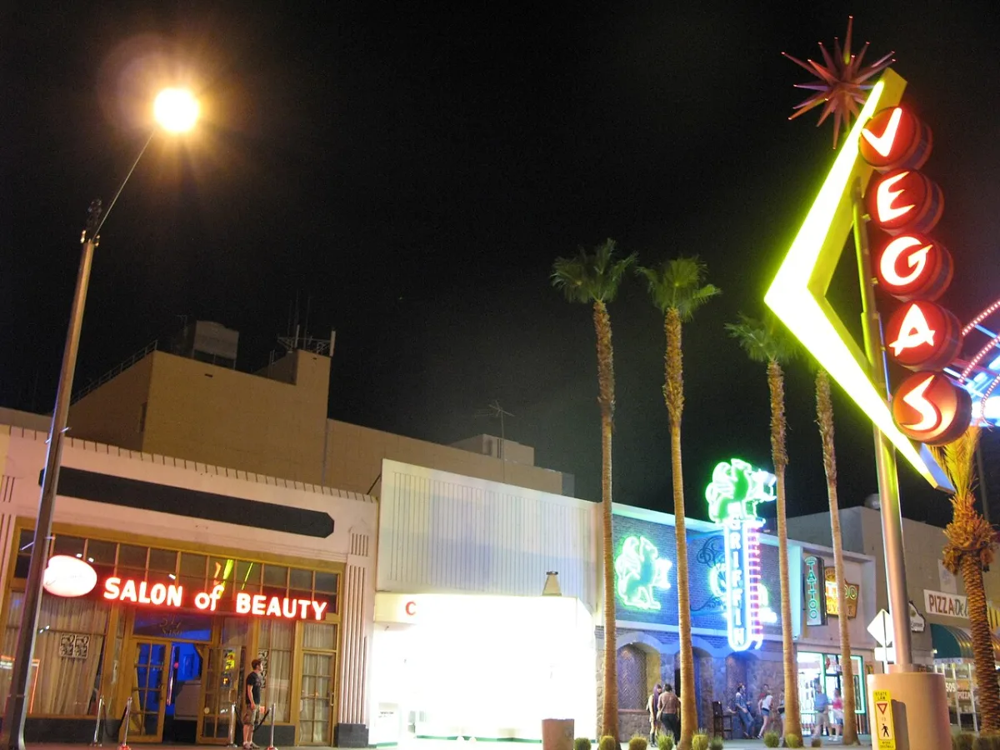

<dl>
<dt>District</dt><dd>North Midtown Broadway strip</dd>
<dt>Type</dt><dd>Nightclub and feeding ground</dd>
<dt>Claimed By</dt><dd>Allicia through Victor under Modius's shadow</dd>
<dt>Theme</dt><dd>The Panopticon</dd>
<dt>Mood</dt><dd>Neon-drenched paranoia, sweat, and watchfulness</dd>
<dt>City</dt><dd>Gary</dd>
</dl>

## Physical Read

- Persian-palace pretension over a decaying strip club shell.
- Pool tables, runways, chipped plaster, bricked windows, back-lot shadows, and a dumpster good for ugly surprises.

## Function in Play

- Gary's main nightlife node.
- The place to feed, tempt, gather rumor, make mistakes, and trigger Blood at Dawn.

## Who Controls It

- Victor runs the floor.
- Allicia defines the mood.
- Modius benefits from it.
- Every other faction tries to use it without owning it.
