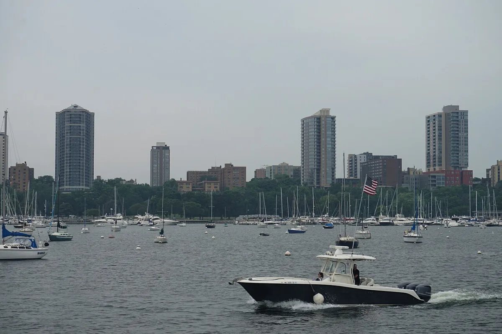

<dl>
<dt>District</dt><dd>McKinley Veterans Park marina</dd>
<dt>Type</dt><dd>Houseboat, gang headquarters</dd>
<dt>Claimed By</dt><dd>[Turk](/npcs/turk/) (Union)</dd>
<dt>City</dt><dd>Milwaukee</dd>
</dl>

## Physical Read

- A big houseboat, well-maintained by marina standards. Not luxury — functional. The kind of boat owned by someone who lives on it.
- Below deck: Union meeting space, weapon storage, communications. Turk's personal quarters in the stern.
- The marina at McKinley Park: quiet at night, open water on one side, park green space on the other. The wind off Lake Michigan carries sound. N Lincoln Memorial Dr runs along the park's western edge — vehicle approaches are visible.
- Docked among civilian boats. The Union's presence is discreet enough to avoid attention from marina management.

## Function in Play

Union HQ. Turk's haven. A large houseboat docked at the McKinley Veterans Park marina at 1750 N Lincoln Memorial Dr on Milwaukee's lakefront. The Union operates from here — meetings, supply storage, muscle on deck. If the coterie investigates the Union, the boat is where the evidence lives. If they attack the Union, the boat is the objective.

## Who Controls It

- Turk. His haven, his headquarters, his territory.
- Union members maintain a presence. At least two or three on the boat at any time.
- Through the Dominate chain: [Merik](/npcs/terence-merik/) controls the boat because Merik controls Turk.
