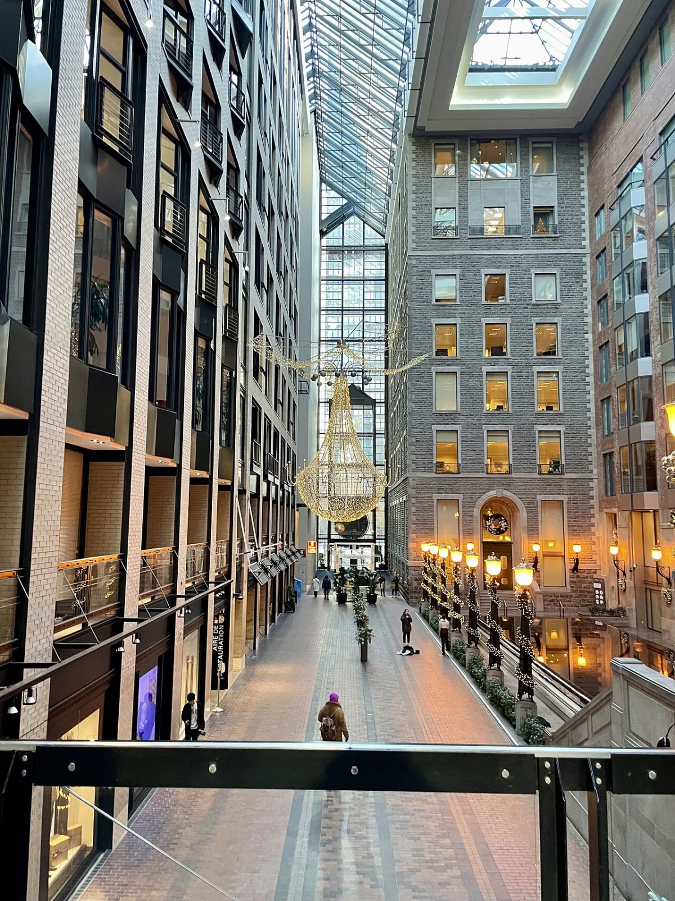

<dl>
<dt>District</dt><dd>Downtown (subterranean)</dd>
<dt>Type</dt><dd>Tunnel network and movement corridors</dd>
<dt>Claimed By</dt><dd>[Elias the Whale](/npcs/elias-the-whale/)</dd>
<dt>City</dt><dd>Montreal</dd>
</dl>

## Physical Read

- Not a single tunnel but a network of connected spaces built over decades. Some sections are polished marble concourses with fluorescent lighting and retail storefronts. Others are raw concrete service corridors where the lights flicker and the air tastes like standing water.
- The populated sections carry half a million mortal commuters during business hours. After the metro closes at 1:30 AM, the corridors empty in stages — the mall sections first, then the metro platforms, then the service tunnels where only maintenance workers and the dead have business.
- Deeper than the official maps show. Utility conduits, abandoned construction staging areas, sealed-off metro tunnels from route changes, Véronique's purpose-built Sabbat maintenance corridors. [Elias](/npcs/elias-the-whale/) knows these spaces. Most others don't.

## Function in Play

- The coterie's primary movement corridors. Thirty-plus kilometers of tunnels connecting metro stations, shopping centers, office towers, and university buildings.
- Safe transit between locations without surface exposure. The underground alternative to streets where packs patrol and mortals notice patterns.
- Elias controls the chokepoints. Using the tunnels means owing Elias, or at least not offending him.

## Who Controls It

- [Elias the Whale](/npcs/elias-the-whale/). He has lived down here long enough that the tunnel network is an extension of his body. He knows every maintenance schedule, every dead-end, every passage that connects to somewhere it shouldn't.
- Elias does not claim the populated sections — he can't control what happens in a lit mall concourse during business hours. He controls the margins. The service corridors, the sealed tunnels, the spaces between the spaces.
- Other Sabbat use the tunnels, but they use them on Elias's sufferance. He can redirect, delay, or trap anyone who doesn't know the network the way he does.
