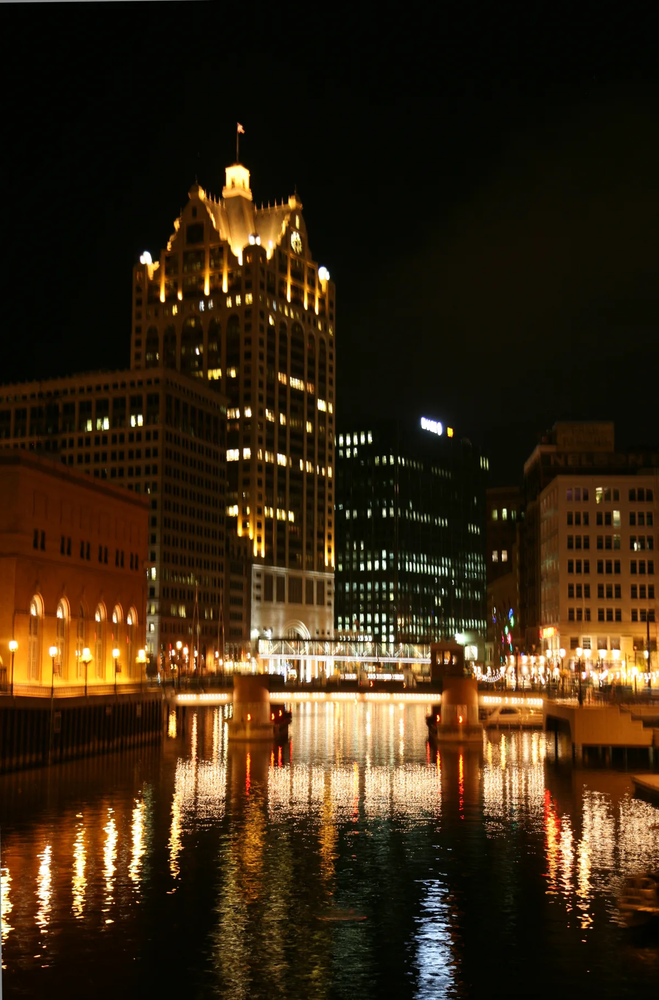

<dl>
<dt>District</dt><dd>West Downtown</dd>
<dt>Type</dt><dd>Elder territory district</dd>
<dt>Claimed By</dt><dd>Primogen Council Elders</dd>
<dt>City</dt><dd>Milwaukee</dd>
</dl>

## Physical Read

- Commercial high-rises, hotels, civic buildings, restored Victorian architecture along W Wisconsin Ave and W Kilbourn Ave.
- Clean streets, working streetlights, police presence. The part of Milwaukee that still functions.
- The Crucible clubs bring mortal nightlife into the Elder district after dark — cover and feeding infrastructure in one.
- At night, the emptiness of a business district after hours. The Kindred own this territory by default — nobody else is here past ten.

## Function in Play

The power center. West Downtown is where the Elders keep their havens, where [MECCA](/locations/mecca/) stands, and where the Primogen Council's authority radiates outward. Old money, institutional buildings, the kind of Milwaukee that appears in tourism brochures. The rot here is structural, not visible — a mad Prince in a nice penthouse, two Elders in a blood feud that consumes Council function, and a Sabbat spy attending every meeting.

## Who Controls It

- The Primogen Council, collectively. Individual Elders maintain havens throughout the district.
- [Merik](/npcs/terence-merik/)'s penthouse anchors the district from above. MECCA sits at its center on W Kilbourn Ave.
- [Gracis](/npcs/gracis-nostinus/) keeps his Kilbourntown house northwest of MECCA. [Hrothulf](/npcs/hrothulf/)'s primary compound is in [the Outlands](/locations/the-outlands/), but his Council presence radiates from this district.
