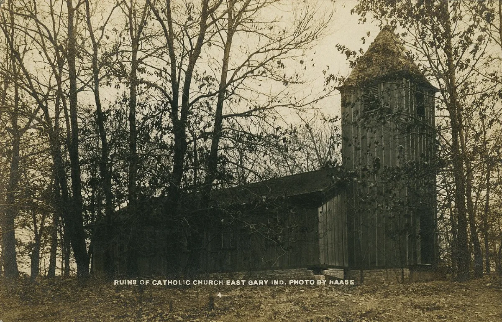

<dl>
<dt>District</dt><dd>South Tolleston / west Midtown edge</dd>
<dt>Type</dt><dd>Slave auction site</dd>
<dt>Claimed By</dt><dd>[Williams](/npcs/williams/)</dd>
<dt>City</dt><dd>Gary</dd>
</dl>

## Physical Read

- Empty church shell, bad lights, sedated people, improvised holding space, and traffic that never stays longer than it must.

## Function in Play

- The clearest horror site in the sandbox.
- Use it when you need to force a moral choice and then live with the consequences.

## Who Controls It

- Williams through terror, routine, and the complicity of buyers who want no record.
