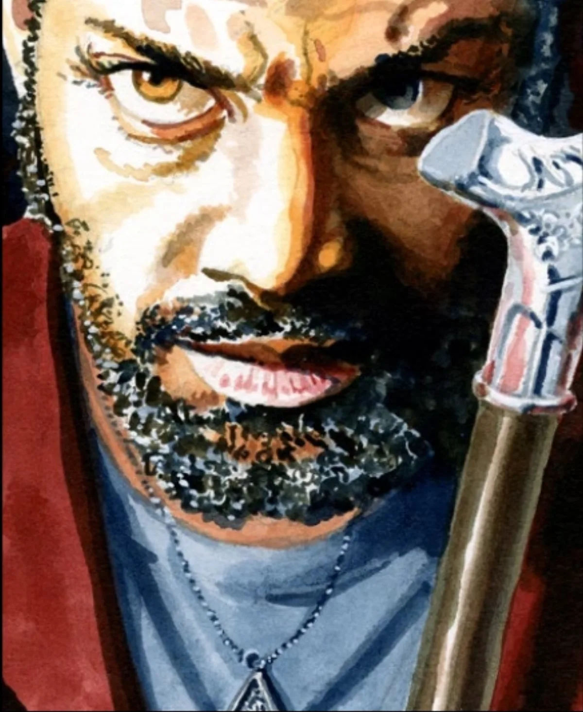

<dl>
<dt>Clan</dt><dd>Tremere</dd>
<dt>Generation</dt><dd>7th generation</dd>
<dt>Role</dt><dd>Tremere Chantry head / senior Tremere in Chicago</dd>
<dt>City</dt><dd>Chicago</dd>
</dl>

During World War II, Nicolai began searching Chicago's elite for a suitable Embrace candidate — someone who at least appeared older, since his own youthful appearance was a hindrance. He found Abraham DuSable almost by chance. DuSable was a cultured and able lawyer, becoming more and more frustrated at the constraints of his aging mortal shell. Despite his great skill as an attorney, his high intelligence, and his ability to trace his heritage back further than almost any white man in the city, his being Black would forever prevent him from attending the opera, having a drink at one of the men's clubs, or riding the whites-only trolley.

Nicolai found this embittered 60-year-old perfectly suited for his plans. He visited the lawyer one night when DuSable was feeling especially bitter, and after a brief display of his capabilities, convinced the distinguished gentleman to become his childe. Nicolai was surprised he needed no Domination to accomplish this. DuSable had some family in the city, but it was a simple matter to fake his death in an apparent racist attack.

After several months, Nicolai took DuSable to Vienna to meet the Tremere Elders. The Tremere was all DuSable had ever hoped for — true power, based solely on his ability to use it, not on the color of his skin. He willingly drank the Blood of the Elders for a three-day period and was then completely and happily bound to the clan.

During the succeeding decades, DuSable has never questioned the morality or ethics of what he has done. He has no interest in mortal society, though upon returning to Chicago he did consider revenge against all who he felt had wronged him. Nicolai quickly dissuaded him. His years of tutelage have led him to feel that revenge is a petty desire compared to the drive for power which motivates most Tremere.

DuSable is the most prominent Tremere any player characters are likely to meet in the city. He runs the Chantry where Nicolai stays and is known among the Tremere throughout the region. He feeds mostly on animals because he finds it convenient and so he will not have to disrupt his study of Thaumaturgy. Still, he does occasionally hunt a human for the sheer thrill involved. He still tends to follow Nicolai on most matters, but his primary loyalty lies with the Tremere itself. Except for a single mistake — the creation of Maldavis — he would be completely fulfilled. Now he is always fearful that someone will discover that it was he who created her.
