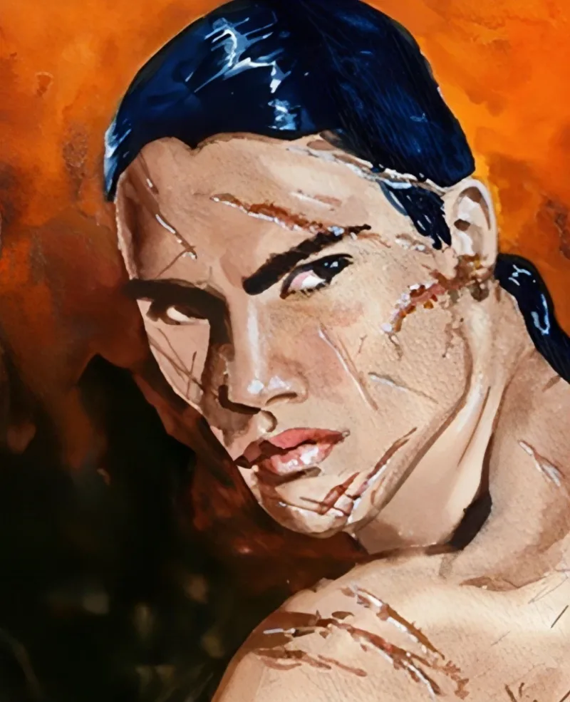

<dl>
<dt>Clan</dt><dd>Brujah</dd>
<dt>Generation</dt><dd>8th generation</dd>
<dt>Role</dt><dd>Blood Brothers Leader</dd>
<dt>City</dt><dd>Milwaukee</dd>
</dl>

Akawa was born around 1750 into a Plains Indian nation in the Missouri River basin, then part of the vast territory France claimed as la Louisiane. The name "Akawa" suggests Kaw (Kanza) origin -- the people the Kansas River and later the state were named for. The Kaw lived in earth-lodge villages along the Missouri and its tributaries, farming corn and squash in summer, hunting bison on the western prairies in autumn. Warrior initiation among the Kaw involved fasting, endurance ordeals, and a vision quest that marked a young man's passage into the fighting society. Akawa had just completed these rites when the stranger came.

The year was 1770. France had ceded la Louisiane to Spain in 1762, though French trappers and traders still moved through the river valleys. White settlement was a pressure, not yet a flood. Akawa's village sat at the edge of that pressure -- close enough to trade with the coureurs de bois, far enough to maintain the old ways. Most of the warriors were away on a hunt or a raid when [Sir Edward Scott](/npcs/sir-edward-scott/) stumbled into the village at night, weakened and fleeing white settlers who had caught him feeding. Akawa investigated alone. [Scott](/npcs/sir-edward-scott/) drew symbols in the dirt showing pursuit. When the knight began to collapse, Akawa reached out to steady him. [Scott](/npcs/sir-edward-scott/) seized his wrist and bit.

The pain was enormous. The pleasure was worse. Akawa's warrior training gave him the discipline to strike back, but [Scott](/npcs/sir-edward-scott/) was a 7th-generation Brujah with centuries of combat experience. The Embrace was not a gift. It was an accident of proximity and desperation -- [Scott](/npcs/sir-edward-scott/) needed blood and a distraction, and the young warrior was both. Afterward, [Scott](/npcs/sir-edward-scott/) vanished into the night. He does not remember the Embrace. He does not remember Akawa at all.

The decades that followed were a slow devastation. Akawa watched from the treeline as his people were penned onto reservations -- first the 1825 treaty that confined the Kaw to a strip along the Kansas River, then the successive reductions that shrank even that. They traveled by day. He could not follow. He fed from animals and hated himself for it. The cities were the only refuge from the Lupine packs that hunted the open prairies. He came to them reluctantly. The first ones stank of horse manure and coal smoke and the diseases white settlers carried. He learned English, then the architecture of urban predation.

By the twentieth century Akawa had become what the cities made him: a warrior translated into street grammar. He built the Blood Brothers in Milwaukee's [East Downtown](/locations/east-downtown/) -- not a Brujah ideological project but a survival structure. He controls the feeding grounds because feeding grounds are the only currency that matters. Every neonate who hunts his turf owes him. Every abandoned childe who needs protection joins or dies. The Blood Brothers are not the Anarchs' conscience. They are Akawa's machine.

The revenge against [Scott](/npcs/sir-edward-scott/) is patient work. Scott sits on the Primogen Council as champion of the Anarchs, playing the role of protector. He does not know that one of the Anarchs he claims to defend is his own abandoned childe, and that childe has spent two hundred years sharpening a grudge into something functional. Akawa does not need Scott dead. He needs Scott to remember, and then to understand what forgetting cost.
