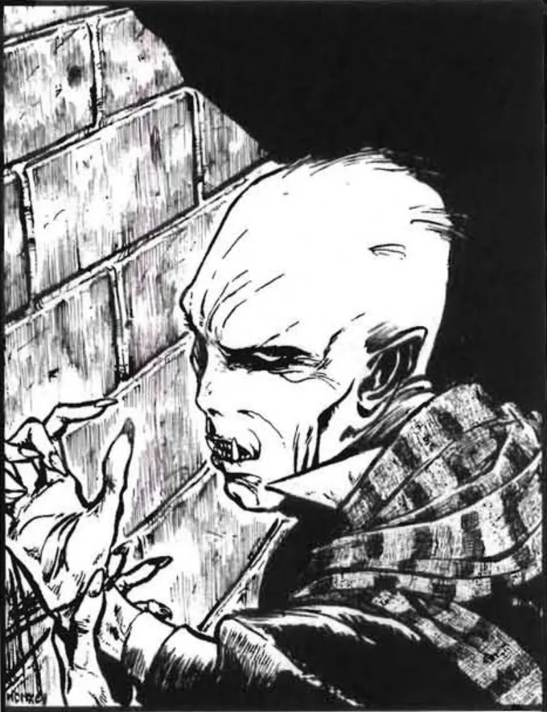

<dl>
<dt>Clan</dt><dd>Nosferatu</dd>
<dt>Generation</dt><dd>7th generation</dd>
<dt>Role</dt><dd>Wandering Elder</dd>
<dt>City</dt><dd>Gary</dd>
</dl>

Alexander Danov was Embraced somewhere in Eastern Europe before 1400, though the precise date, location, and identity of his sire are unknown. What survives is a single reference point: he spoke with Lucian before the Battle of Tannenberg in 1410, and Lucian referred to Danov's "youth" — suggesting the Embrace was recent enough to be remarked upon by someone who measured time in centuries.

Tannenberg itself provides context for the world Danov entered as Kindred. On July 15, 1410, the combined forces of the Kingdom of Poland and the Grand Duchy of Lithuania met the Teutonic Knights on the fields near Grunwald in one of the largest battles in medieval European history. Approximately 60,000 combatants fought across a landscape of marsh, forest, and open field. The Teutonic Order was shattered. The political map of northeastern Europe shifted permanently. For Kindred observers — and Lucian was one — the battle represented the kind of mortal cataclysm that reshuffled territorial claims, destroyed havens, and forced migration. A newly Embraced Nosferatu navigating that landscape would have learned immediately that survival meant movement, observation, and silence.

The name "Danov" is an adoption. He took it during an extended period in Russia sometime in the mid-to-late nineteenth century — the era of Alexander II's reforms, the emancipation of the serfs in 1861, the populist movements, the assassination of the Tsar in 1881, and the industrial transformation that remade Russian cities while the countryside starved. What Danov did there, or why he chose to identify with a Russian patronymic, he has not disclosed. The name suggests he embedded himself in Russian society deeply enough to require a local identity, which for a Nosferatu means either exceptional Obfuscate or a network of mortal intermediaries willing to deal with a man whose face inspired revulsion.

For the last half-century he has been moving slowly across North America, city to city, on what he describes as "a simple search for existence." The trajectory reads as a deliberate pilgrimage. Five hundred years of unlife have given him the perspective to recognize that most Kindred power struggles are recursive — the same territorial disputes, the same generational resentments, the same betrayals repackaged in new cities with new names. Danov has watched enough of the cycle to find it instructive rather than compelling.

He is searching for Golconda. The nature of that search is private, but its effects are visible: the Judge's Nature, the quiet watchfulness, the refusal to align with any faction or prince, the willingness to speak about Golconda with those who demonstrate sufficient maturity. He has said he will guide seekers toward the Suspire — the meditative state that precedes Golconda — and may provide directions to the Inconnu if he judges the seeker worthy.

Physically, he is tall, average in build, with a wide face dominated by deep-set grey eyes that the source material identifies as "the only attractive part." His skin is coarse and crinkled, his face twisted, his remaining hair growing in erratic tufts. The text calls him "an exquisite example of a Nosferatu" — which is to say, a body that announces its curse without apology. His manner compensates: the smallest smile, the quietest chuckle, the reaction calibrated to convey understanding without revealing position. Six centuries of practice at being the least noticeable presence in any room, even when his face should make him the most.
