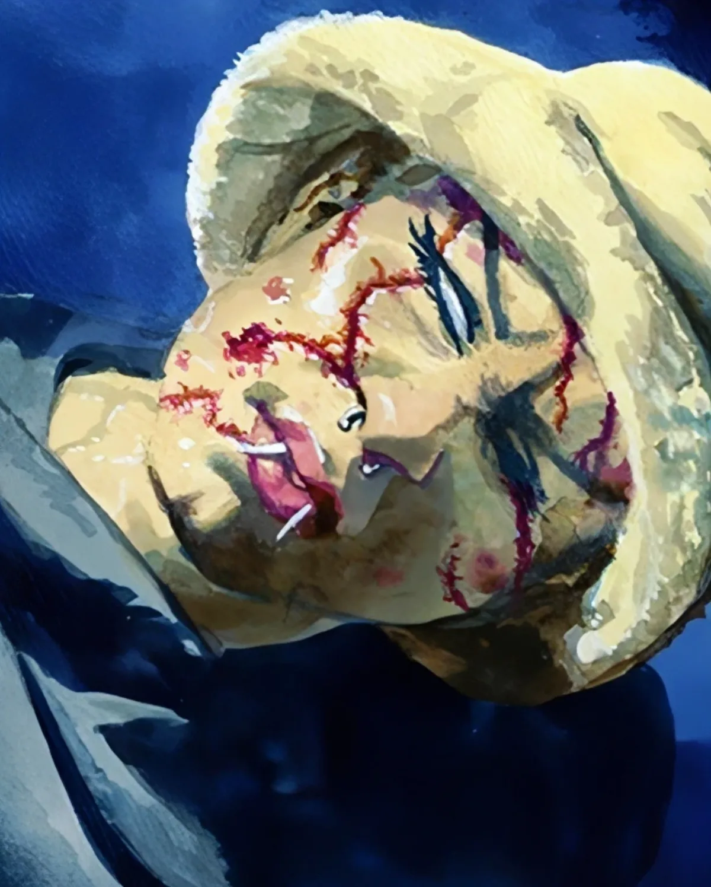

<dl>
<dt>Clan</dt><dd>Nosferatu</dd>
<dt>Generation</dt><dd>8th generation</dd>
<dt>Role</dt><dd>Parovich's childe (fugitive)</dd>
<dt>City</dt><dd>Milwaukee</dd>
</dl>

Embraced in 1989. Anastasia was the most popular girl in school — gorgeous boyfriend, hot sports car. A car accident killed her parents and left her disfigured. Parovich showed up to "help." She was Embraced into the Nosferatu and joined Parovich's household of childer.

When Kristian discovered Parovich's connections to the Black Hand, he told the childer to flee. Anastasia hides in empty cellars and sewer drains, hunts stray cats for blood, and keeps a small collection of cats that follow her when she moves. Kristian visits about once a week, bringing flowers or perfume.

Still looks young despite disfigurement from both the accident and the Nosferatu Embrace. Wears an old high school dress — frilly, bright-colored, now faded to dingy brown.

**Apparent Age:** 16
**Embrace:** 1989
