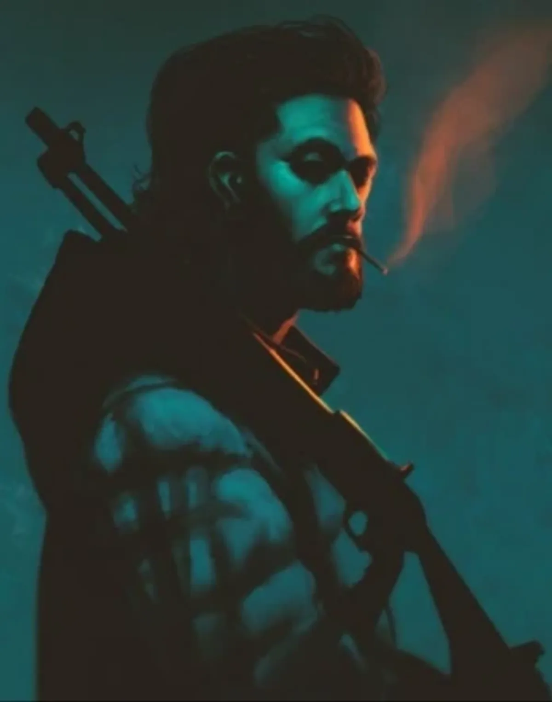

<dl>
<dt>Clan</dt><dd>Gangrel</dd>
<dt>Generation</dt><dd>8th generation</dd>
<dt>Role</dt><dd>Wolf Pack intellectual / biker Gangrel</dd>
<dt>City</dt><dd>Chicago</dd>
</dl>

A Greek immigrant to America shortly after the Civil War, Anthius became a trapper near present-day Seattle at the edge of a forest inhabited by a Gangrel. After his animals kept falling ill, he caught a wolf fleeing from his mule one night. A war of wits and tenacity followed for almost a month. Finally, his opponent decided Anthius was worthy of the Embrace. The Gangrel entered his cabin in human form and spoke to him of the forest through the eyes of a wolf. By dawn, Anthius was Changed.

He stayed in Washington until World War II, when he returned to Greece to help free his homeland from Nazi occupation. After the war he joined the Greek communists, the most effective freedom fighters against the Germans, in their fight against British occupation forces. The Soviet Union's refusal to help the communists led to their defeat, and Anthius returned to America. On his way back to Washington he met [Tyrus](/npcs/tyrus/), and the two have been companions ever since. [Tyrus](/npcs/tyrus/) trusts and respects Anthius like no one else, and Anthius has developed a great fondness for the nomadic life and culture of bikers.

During [Maldavis](/npcs/maldavis/)' rise to power, the Pack split on whom they should support. [Tyrus](/npcs/tyrus/) wanted to keep their traditional loyalties, while Anthius voiced support for the upstart. [Inyanga](/npcs/inyanga/) intervened and warned them to keep clear of the conflict.

**Image:** A tall, slim Greek man of about 28, with long straggling hair and an untrimmed beard. Dresses in leathers but wears no metal at all -- no studs, no bullet belt, no metal whatsoever. Eschews a helmet for a pair of World War I aviator goggles.

**Roleplaying Hints:** Never talks to anyone outside the gang. When someone else addresses him directly he is more likely to just stare at them than respond.

**Haven:** Spends most nights on the road but also keeps a Haven in a public library in Rock Island.

**Secrets:** B
