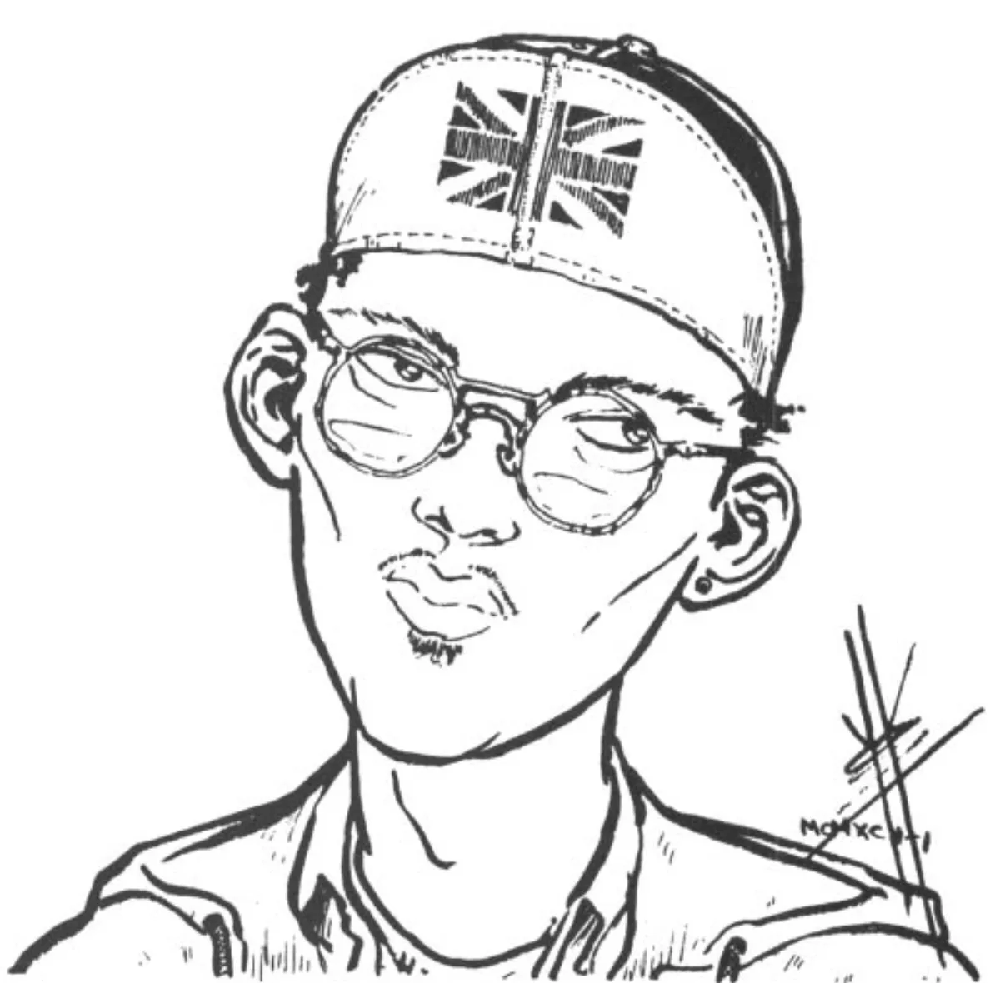

<dl>
<dt>Clan</dt><dd>Toreador</dd>
<dt>Generation</dt><dd>10th generation</dd>
<dt>Role</dt><dd>Neutral Kindred radio DJ</dd>
<dt>City</dt><dd>Milwaukee</dd>
</dl>

Embraced in 1934. On-air persona is "Derik Dark, only after sundown and not for the faint of heart." Sondra heard him spinning stories down in Louisiana and was entranced; she Embraced him a couple weeks later, telling him he would tell stories forever.

Barth has stepped out of the Jyhad by making himself too publicly visible to kill — rubbing him out would risk the Masquerade. He broadcasts coded messages to Kindred during his show: announcing parties, rumbles, and Vampire news disguised as something else. Sometimes says it out loud, which gets the Elders angry. Walks the middle line — no enemies, but no friends either. On very good terms with [Lucina](/npcs/lucina/) and tries to keep her aware of particularly destructive Anarch plans.

Does not look anything like his voice sounds. Sounds deep, powerful, and magnificent, but is a skinny, geeky-looking man with a greasy mop of black hair. Physically uninteresting and unattractive, but his voice makes him the idol of millions. Gives off an aura of happiness and confidence.

**Apparent Age:** Mid-20s
**Embrace:** 1934
