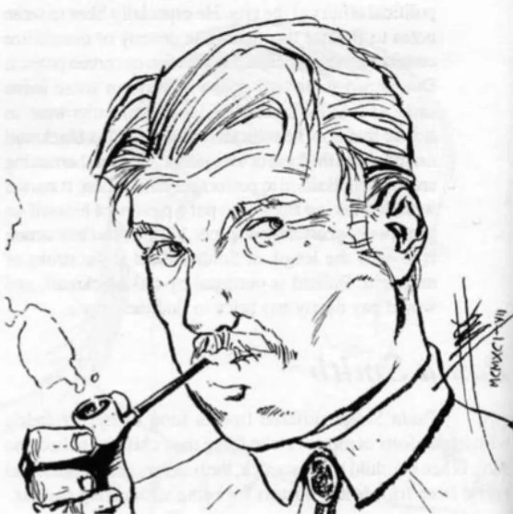

<dl>
<dt>Clan</dt><dd>Malkavian</dd>
<dt>Generation</dt><dd>8th generation</dd>
<dt>Role</dt><dd>Schizophrenic Malkavian / institutional resident</dd>
<dt>City</dt><dd>Chicago</dd>
</dl>

Ben Smith's delusions began mildly enough, and included belief in UFOs, the communist menace and the honesty of politicians. By the time he turned 30 they became more extreme, until the point came where he believed the sky was orange, clams could talk to him and televangelists really did care about people's spiritual well-being. A concerned aunt had Ben committed to the Illinois Psychiatric Institute for his own good. There he languished for a decade, beyond the help of doctors or drugs.

Ben became one of Paula and O'Leary's herd shortly after entering the Institute. The two preferred to feed off of those patients whose delusions were the most pronounced, a fact that led a team of staff psychologists to make a name for themselves with an article titled *Fears of Blood: Shared Delusions Among the Institutionalized*. However, Ben soon came to believe that he too was a Vampire. He managed to track O'Leary to her Haven in the basement of the Institution, and spent the day asleep beside her, where she found him when she woke that night. Amazed at the conviction this mortal displayed in maintaining that he was Kindred, O'Leary decided to make him one.

After Ben met Paula, he became convinced that since they shared a last name, they were married. Shortly thereafter Paula began to share his delusions. Ben still suffers from schizophrenia, an illness which Blood Points will not heal (or perhaps he never thought to try). He can be convinced of almost anything, but if someone challenges or contradicts one of his fantasies, he is likely to become more convinced of it -- even to the point of backing it up with violence. He has not left the Institution since his Change, but is convinced that he and Son frequently go out and do father-son things together. Son plans to bring this delusion to reality soon.

The institution's staff believes him to have escaped in the mid-1960s, and no doctors are still there from that time to fit a face to patients' descriptions of a kindly old gentleman who drinks their blood at night.

**Image:** Tall and husky, he repaired refrigerators as a mortal and looks like the archetypal refrigerator repair man. Has recently taken to smoking a pipe in the belief this makes him look more fatherly.

**Roleplaying Hints:** Nothing is impossible, and most of the strangest-sounding things are almost certainly true. Make up anything you want, and stick by it no matter what evidence is presented to the contrary.

**Haven:** Illinois Psychiatric Institute.

**Secrets:** [OCR unclear]
