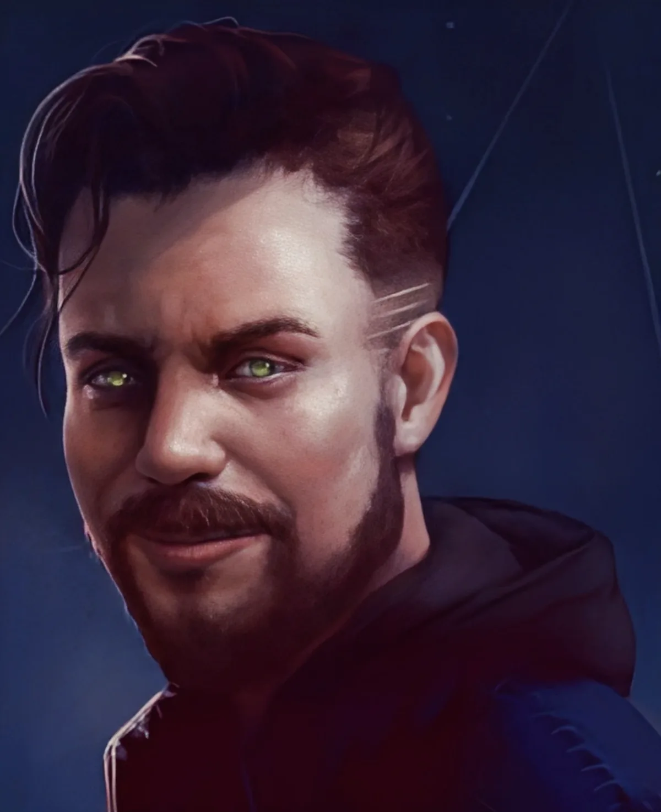

<dl>
<dt>Clan</dt><dd>Ventrue</dd>
<dt>Generation</dt><dd>8th generation</dd>
<dt>Role</dt><dd>[Lodin](/npcs/lodin/)'s hacker / reluctant lieutenant</dd>
<dt>City</dt><dd>Chicago</dd>
</dl>

Growing up in Cicero, Illinois, Bobby Weatherbottom's father bought the boy his best friend when Bobby was eight — a computer with 4K memory which could do almost nothing. Bobby was fascinated. By the time he was 16 he had put together numerous kit computers, written programs covering almost every conceivable area, and begun to fail high school. He dropped out on his 18th birthday and moved into a dirty apartment in a broken-down part of Cicero.

Despite never having a job, Bobby had little problem paying his bills. At the electric company, the phone company, the grocery deliverers and the credit card companies, their computers always registered his bills as paid in full. His growing ability with a computer and a modem also earned him a steady income from a savings account manipulation scam he ran against Illinois' largest bank. The legendary "Hurricane" became known among hackers worldwide. No copy protection could prevent him from copying a program.

Then Amanda Cersey came into his life. A ravishing brunette from one of Chicago's oldest families, she had a problem — her father was being blamed for embezzling money from a bank, and only Bobby could make things look right. Bobby quickly discovered that the only person who could have done the embezzling was Amanda herself. Swiftly falling in love with her, Bobby was happy to oblige. Soon Amanda was coming to him with all sorts of corporate spying to commit.

Amanda eventually contacted a "distant cousin" — [Annabelle](/npcs/annabelle-triabell/) Treabelle, in fact her great-grandmother several times removed — who had always been known for being able to help with intractable problems. [Annabelle](/npcs/annabelle-triabell/) mentioned him to [Lodin](/npcs/lodin/) at the Opera. The Prince became fascinated by the idea of a lieutenant who could control the city's computer networks.

Meanwhile, Bobby had gone to see Amanda and poured his heart out. They found common ground in their mutual emotional isolation, and Amanda began to warm to him. Bobby returned home the next morning dreaming of their life together — to find the Prince of Vampires waiting by his computer. Lodin did not even take the time to explain what was going to happen. He was on the young man before Bobby could resist.

Amanda found his apartment with blood spattered about and ran to Annabelle. Annabelle called a meeting of the Primogen and railed against the Prince's uncontrolled creation of Neonates. It was at this meeting that the Primogen decided to teach Lodin a lesson and began their support of [Maldavis](/npcs/maldavis/). The ensuing battle tore the Vampiric community in two.

As part of his submission to the Primogen, Lodin reunited Amanda and Bobby. Bobby wants nothing more than to be free of Lodin's Domination and to live his life in peace with Amanda. She knows of his new existence. Bobby has never fed on anyone else — thus, he never has more than one point of blood in his system — nor can he feed on anyone else. Annabelle protects both of them, and would destroy anyone who hurt either.
