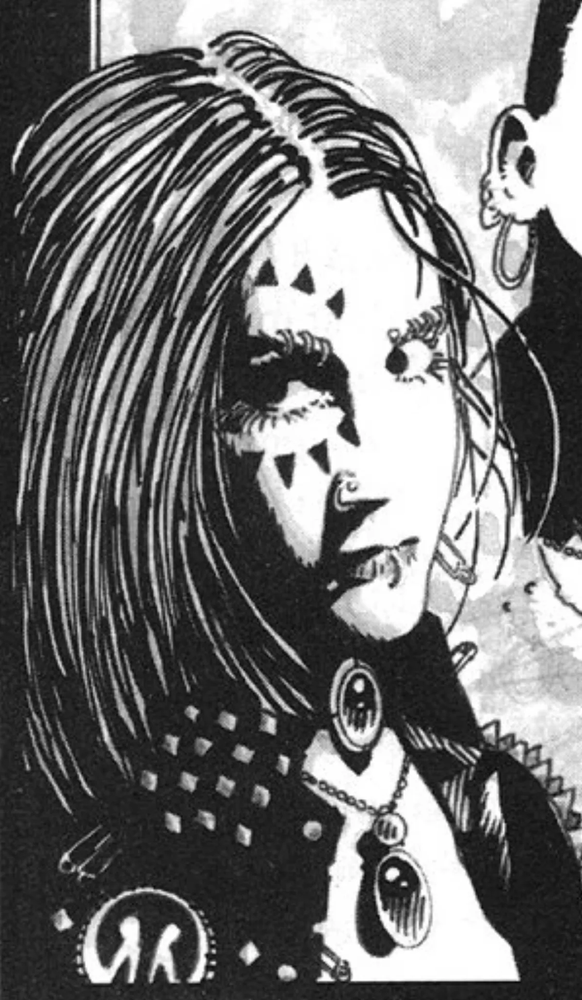

<dl>
<dt>Clan</dt><dd>Ravnos antitribu</dd>
<dt>Generation</dt><dd>10th generation</dd>
<dt>Role</dt><dd>Enslaved Inquisitor trapped in [Pierre Bellemare](/npcs/pierre-bellemare/)'s pack</dd>
<dt>City</dt><dd>Montreal</dd>
</dl>

Knight Inquisitor Elisa Karini arrived in Montreal in the aftermath of [Sangris](/npcs/sangris/)' trial to search out any hidden accomplices. While Krieg, Elisa's Nosferatu antitribu partner, simply appeared in the city as a nomad, she infiltrated the circus of the Tzimisce [Zarnovich](/npcs/zarnovich/), assuming the alias of "Sonya, Mistress of Illusions." A follower of the Path of Cathari, Elisa also took advantage of her visit to learn from the Widows.

As the months passed, Elisa entered the dark world of the Widows and her duties as an inquisitor took second place to her quest for enlightenment as a Cathar. Unfortunately, Pierre Bellemare was ready to take advantage of Elisa's distraction. Pierre uncovered Krieg's identity in 1993. After 13 days of torture, the Nosferatu surrendered the name of his partner. Pierre then lured Elisa to the ramshackle house in [Old Montreal](/locations/old-montreal/) that hid Metathiax's Blood Circle. Her inquisitor's instincts re-surfaced too late, and she was overwhelmed by a swarm of diseased rats. Not content to kill his victim, Pierre drew on the power of the Decani to rot Elisa's body and re-formed it. The demon's power also chained her soul and will, turning her into Cairo, the perfect slave.

Pierre never realized that Cairo was a skilled Thaumaturgist. She has spent the years since her imprisonment loosening the chains around her soul. The pack's weekly Vaulderie strengthens Cairo's bondage, but for the last three months she has worked herself relatively free for a few nights a week. Not yet strong enough to actively challenge her tormentor, Cairo is trying her best to subtly expose Pierre's infernalism and stop his corruption from spreading. She is desperate to get to [Ezekiel](/npcs/ezekiel/) to warn him, but her efforts have been inexplicably thwarted by Santiago DeSoto.

**Image:** Pierre replaced Elisa's lithe form and long black hair with a stocky Riot-Grrrl frame and shocking red hair. Cairo dresses to complement her lord, wearing black leather and dozens of body piercings.

**Secrets:** Cairo is familiar with the location of Metathiax's Blood Circle, knows of the demon's plans to corrupt Ezekiel and has experienced the full extent of Pierre's perversity.
