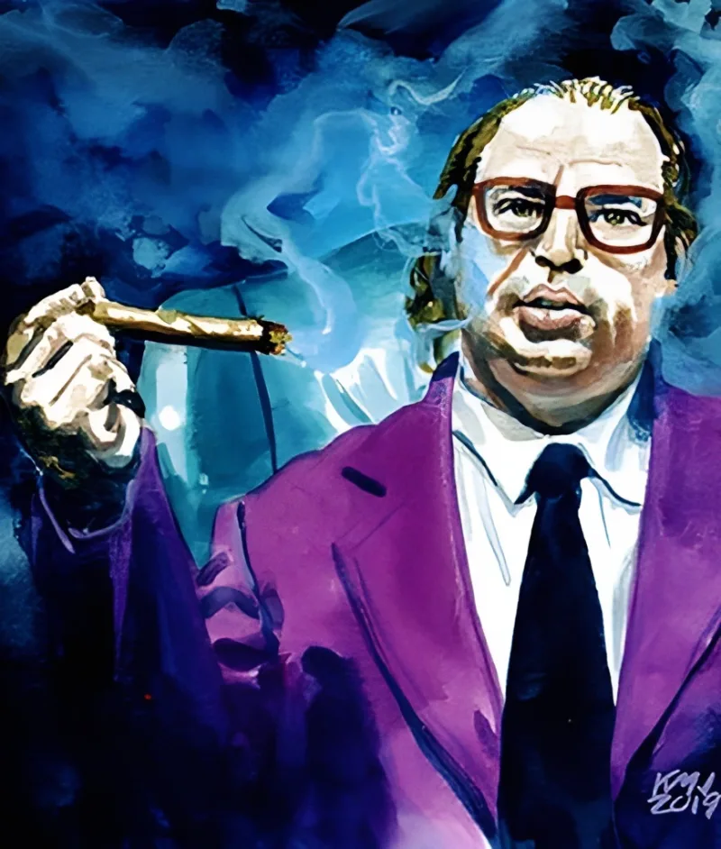

<dl>
<dt>Clan</dt><dd>Ventrue</dd>
<dt>Generation</dt><dd>8th generation</dd>
<dt>Role</dt><dd>Organized Crime Elder</dd>
<dt>City</dt><dd>Chicago</dd>
</dl>

Alphonse Gabriel Capone, born January 17, 1899, in Brooklyn, New York. Parents were Gabriele and Teresina Capone, immigrants from Angri, a town near Naples. Gabriele was a barber. The family lived in a tenement near the Brooklyn Navy Yard — Park Slope before Park Slope meant anything except proximity to the docks and cheap rent for Italians. One of nine children. The neighborhood was a compressed geography of Irish, Italian, and Jewish immigrants competing for the same jobs, the same blocks, the same narrow margin between subsistence and the street.

Capone left school at fourteen after hitting a teacher. Ran with the South Brooklyn Rippers, then the Forty Thieves Juniors, then the Five Points Gang under Frankie Yale. Johnny Torrio — Yale's lieutenant and the man who would reshape Chicago's underworld — noticed the kid. Capone worked as a bouncer at Yale's Harvard Inn on Coney Island, where a remark to a woman's brother earned him the three razor scars on his left cheek. He hated the nickname "Scarface." Everyone used it anyway.

Torrio summoned him to Chicago in 1919. Prohibition arrived the following January, and Torrio had already built the infrastructure to profit from it. Capone was muscle first, then management, then — after Torrio was shot and retired to Italy in 1925 — the boss. By twenty-six, Al Capone controlled the largest bootlegging operation in the Midwest. The St. Valentine's Day Massacre of February 14, 1929, eliminated the North Side Gang's leadership in a garage on North Clark Street and made Capone the most famous criminal in America. He had done all of this without a single vampire's assistance.

[Lodin](/npcs/lodin/) watched with amusement. The Prince of Chicago found "the little Italian" entertaining and useful — mortal organized crime generated cash, controlled neighborhoods, and provided a ready-made infrastructure of violence that no Kindred needed to build from scratch. [Lodin](/npcs/lodin/) ensured that no other vampire Dominated or blood-bound Capone. The asset was to remain [Lodin](/npcs/lodin/)'s alone.

When the violence became inconvenient, Lodin arranged the solution. The IRS investigation, the tax evasion charges, the October 1931 conviction — Lodin's influence in federal law enforcement guided the prosecution. Capone was sentenced to eleven years. He served time at the Atlanta US Penitentiary, then Alcatraz from 1934 to 1939. By the time he was released, tertiary syphilis had destroyed his cognitive function. The press reported a shambling wreck who could barely recognize his own family at the Palm Island estate in Florida.

Lodin visited in 1941. The offer was straightforward: immortality, restored faculties, and a return to power, in exchange for eternal loyalty to the Prince. Capone accepted without hesitation. The Embrace burned the syphilitic damage out of his brain like cauterizing a wound — the Blood repaired what medicine could not. The next night, Capone visited every mob boss in Chicago. Presence and Dominate did in hours what years of bootlegging violence had accomplished the first time. The Outfit was his again, and this time the consolidation was permanent.

The mortal Capone had been dead for two years before anyone in the underworld understood that the organization had changed ownership back. The public Al Capone died January 25, 1947, at Palm Island — a carefully staged death, the mortal identity discarded like a spent casing. The Kindred Capone expanded into legitimate business through the 1950s, which brought him into collision with [Ballard](/npcs/ballard/)'s financial territory in the 1960s. The economic war spilled into the streets — mobsters and police in open conflict — until the Primogen ordered Lodin to mediate. Lodin's solution gutted both rivals: police influence stripped from Capone, city government access stripped from [Ballard](/npcs/ballard/), both reserved for the Prince. Neither man forgave the insult, but both accepted it. For now.

The Golconda rumors are the element that does not fit the profile. An elder at Humanity 5 with a criminal empire and a Bravo's demeanor, quietly interrogating Anarchs about transcendence. He threatened to destroy the last one who answered his questions, then made the Anarch disappear. Whether this is genuine spiritual crisis or strategic misdirection, no one in Chicago can say with certainty.
