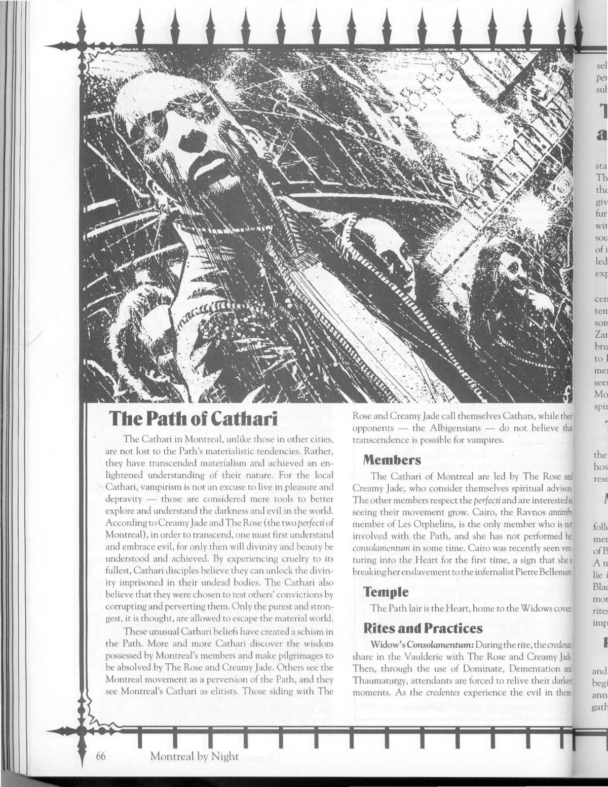

<dl>
<dt>Clan</dt><dd>Pander</dd>
<dt>Generation</dt><dd>11th generation</dd>
<dt>Role</dt><dd>Mattachine member, runaway survivor</dd>
<dt>City</dt><dd>Montreal</dd>
</dl>

Like so many teens who are unable to cope with brutality at home, Caroline was a runaway. Fleeing to the streets of New York, she became an easy target for the chicken hawks who watched the bus terminals. She failed to see the yellow van that followed her, and had no time to react when she was pulled inside. The next few months were a blur of drug-induced hallucinations and a whirl of featureless men who brought only pain.

Caroline underwent forced prostitution until she got pregnant and was stricken with several different venereal diseases. Then her life took an even worse turn. The men who pimped her sold her to a client. Although in a drug-induced stupor, Caroline remembers a filthy and dimly lit room, a masked doctor with bloodied surgical garb and fingers that melted into various-shaped scalpels and blades. To her horror, she cannot remember beyond the point of the doctor spreading her legs open and squatting down to peer inside her.

Caroline emerged from her Creation Rite in the care of the Mattachine, who seemed to be under orders to protect her. Despite her loss of memory, Caroline's new existence gave her the grace, power and beauty that she never had as a human. She also realized that she felt more comfortable around women.

Caroline seemed to be doing well until 1993, when she began suffering from a recurring nightmare about the mysterious "doctor." She awoke repeatedly in a bestial state and had to be monitored on several occasions. Troubled by her dreams and the distorted faces of children that appeared in them, Caroline moved to Montreal in hopes of getting help from the Shepherds.

**Image:** Caroline has shoulder-length, strawberry-blond hair, very petite features and piercings all over her body. When she's around other women, she wears clothes that show off her body work.

**Secrets:** The pregnancy. Caroline suspects that her sire was skilled in Vicissitude and that her nightmares stem from a vile pregnancy spawned by him. She has kept this a secret from everyone, including Celeste.
